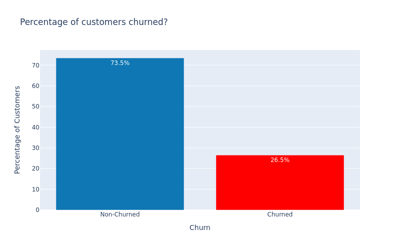
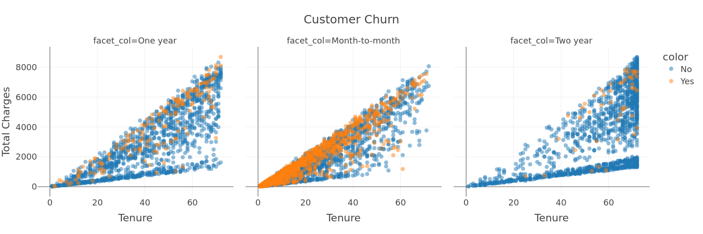
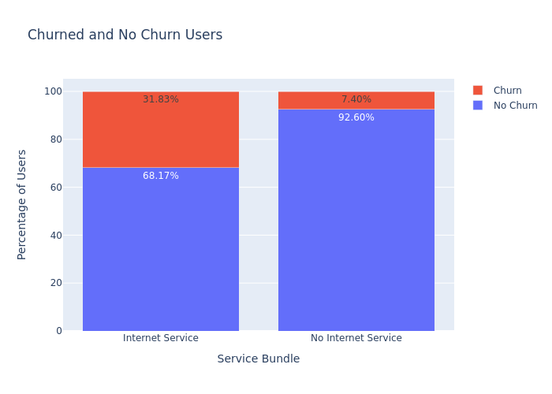

# Create a classification model with CrateDB, Pycaret and MLflow

This notebook guides you through the process of creating a classification
machine learning model with CrateDB and Pycaret. The exciting part: we're
using automatic machine learning model selection, benchmarking and
hyperparameter tuning - commonly known as AutoML.

## CrateDB

CrateDB is a distributed SQL database that makes it simple to store and analyze
huge amounts of time series data in real-time. It provides a robust SQL
interface and a number of anlaytics features that are predestined for machine
learning tasks.

Two additional features stand out:

1. CrateDB allows to store both relational data like strings, floats and
   timestamps as well as complex object types. This makes it easy to store
   the raw data required for machine learning model creation as well as the
   metadata that is often required to make sense of the data.

1. CrateDB offes first-class time partitioning support. This allows to store
   tremendous amounts of data in a single table and still be able to query
   it in a performant way. This is especially useful for time series data
   like sensor data, user tracking data or log data.

## Pycaret

Pycaret is a Python library that makes it easy to create and train machine
learning models in python. The outstanding feature of Pycaret is its AutoML
capabilities.

Pycaret is a high-level interface on top of popular machine learning
frameworks. Among them are scikit-learn, xgboost, ray, lightgbm and many more.

Pycaret provides a simple low-code interface to utilize these libraries without
needing to know the details of the underlying model architectures and
parameters.

The general concept of Pycaret - and for the matter of fact for AutoML in
general - is rather simple: One takes the raw data, splits it into a training
and a test set and then trains a number of different models on the training
set. The models are then evaluated on the test set and the best performing
model is selected. This process gets repeated for tuning the hyperparameters
of the best models. Again, this process is highly empirical. The parameters are
changed, the model is retrained and evaluated again. This process is repeated
until the best performing parameters are found.

Modern algorithms for executing all these experiments are - among other -
GridSearch, RandomSearch and BayesianSearch. For a quick introduction into
these methods, see
[this article](https://medium.com/analytics-vidhya/comparison-of-hyperparameter-tuning-algorithms-grid-search-random-search-bayesian-optimization-5326aaef1bd1).

In the past, all these try-and-error experiments had to be done manually -
which is a tedious and time-consuming task. Pycaret automates this process
and provides a simple interface to execute all these experiments in a
straightforward way. This notebook shows how.

## The dataset

The dataset used to demonstrate the use of Pycaret and CrateDB for training
machine learning models is a churn dataset of a telecom provider.

It includes various attributes relating to customer demographics, services
subscribed to, billing information, and churn status.

- `customerID`: A unique identifier for each customer.
- `gender`: The customer's gender (e.g., Male, Female).
- `SeniorCitizen`: Indicates whether the customer is a senior citizen (1) or
  not (0).
- `Partner`: Indicates whether the customer has a partner (Yes) or not (No).
- `Dependents`: Indicates whether the customer has dependents (Yes) or not
  (No).
- `tenure`: The total amount of time that the customer has been with the
  company.
- `PhoneService`: Indicates whether the customer has a phone service (Yes)
  or not (No).
- `MultipleLines`: Indicates whether the customer has multiple lines (Yes),
  no multiple lines (No), or no phone service.
- `InternetService`: The type of internet service the customer has (DSL,
  Fiber optic, or None).
- `OnlineSecurity`: Indicates whether the customer subscribes to an additional
  online security service (Yes, No, or No internet service).
- `DeviceProtection`: Whether the customer has a device protection plan (Yes,
  No, or No internet service).
- `TechSupport`: Indicates whether the customer has tech support services (Yes,
  No, or No internet service).
- `StreamingTV`: Indicates if the customer has streaming TV service (Yes, No,
  or No internet service).
- `StreamingMovies`: Indicates if the customer has streaming movies service
  (Yes, No, or No internet service).
- `Contract`: The type of contract the customer has (Month-to-month, One year,
  Two years).
- `PaperlessBilling`: Indicates whether the customer has paperless billing (Yes)
  or not (No).
- `PaymentMethod`: The customer's payment method (Electronic check,
  Mailed check, Credit card (automatic), etc.).
- `MonthlyCharges`: The amount charged to the customer each month.
- `TotalCharges`: The total amount charged to the customer over the time they
  have been with the company.
- `Churn`: Indicates whether the customer has churned (Yes) or not (No).

## Getting started

First, install the required dependencies.

```bash
pip install -r requirements.txt
```

> **Note:** As of time of this writing, Pycaret requires Python 3.8, 3.9 or
> 3.10.

Secondly, we need a CrateDB instance to store and serve the data. The easiest
way to get started is to use the free CrateDB cloud offering. You can sign up
for a free account at https://console.cratedb.cloud.

[Deploy a cluster](https://cratedb.com/docs/cloud/en/latest/tutorials/deploy/stripe.html#deploy-cluster)
and we're ready to go.

Finally, create a file `.env` with the following content:

```env
CRATE_HOST=<your-crate-host> # set this to localhost if you're running crate locally
CRATE_USER=<your-crate-user> # set this to crate if you're running crate locally
CRATE_PASSWORD=<your-crate-password> # set this to "" if you're running crate locally
CRATE_SSL=true # set this to false if you're running crate locally
```

You can find your cratedb credentials in your
[CrateDB Cloud Console](https://cratedb.com/docs/cloud/en/latest/reference/overview.html#cluster).

### Creating demo data

For convenience, this notebook comes with an accompanying csv dataset which we
can quickly import in our database. Upload the csv file to your CrateDB cloud
cluster, as described [here](https://cratedb.com/docs/cloud/en/latest/reference/overview.html#import).
To follow this notebook, choose `pycaret_churn` for your database name.

This will automatically create a new crate table and import the data.

### Alternative data import using code

If you prefer to use code to import your data, please execute the following lines which read the CSV
file into a pandas data frame, automatically creates the table in CrateDB and loads the data.

```python
import os
import dotenv
import sqlalchemy as sa
import pandas as pd
if os.path.exists(".env"):
    dotenv.load_dotenv(".env", override=True)

dburi = f"crate://{os.environ['CRATE_USER']}:{os.environ['CRATE_PASSWORD']}@{os.environ['CRATE_HOST']}:4200?ssl={os.environ['CRATE_SSL']}"
engine = sa.create_engine(dburi, echo=True)
df = pd.read_csv("churn-dataset.csv")

with engine.connect() as conn:
    df.to_sql("pycaret_churn", conn, index=False, chunksize=1000, if_exists="replace")
```

## Model creation

Now that our data and environment is set up, we can start creating our model.

The first step is to import the required libraries and to load our data from
the database.

```python
import os
import dotenv
import sqlalchemy as sa
import pandas as pd
import plotly
import plotly.express as plotly_express
import plotly.graph_objects as go
import mlflow_cratedb  # We need this import to use the CrateDB MLflow store

if os.path.exists(".env"):
    dotenv.load_dotenv(".env", override=True)

dburi = f"crate://{os.environ['CRATE_USER']}:{os.environ['CRATE_PASSWORD']}@{os.environ['CRATE_HOST']}:4200?ssl={os.environ['CRATE_SSL']}"
engine = sa.create_engine(dburi, echo=True)

# Insert the data into CrateDB
with engine.connect() as conn:
    with conn.execute(sa.text("SELECT * FROM pycaret_churn")) as cursor:
        data = pd.DataFrame(cursor.fetchall(), columns=cursor.keys())

# We set the MLFLOW_TRACKING_URI to our CrateDB instance. We'll see later why
os.environ[
    "MLFLOW_TRACKING_URI"
] = f"{dburi}&schema=mlflow"
```

Next, let's have a quick glance on how our dataset looks like.
As we already know from chapter [The dataset](#the-dataset), the feature
to predict is `Churn` . Let's have a look at the distribution of this feature.

> **Note:** knowing the distribution of the target feature is important to know
> whether the dataset is imbalanced - meaning that it has much more samples of
> one class than of the other. This is important to know because it can lead to
> biased models - so we can accommodate for this in our model creation process.



The plot reveals that our dataset is indeed skewed towards non-churned users.
Let's keep this in mind for later.

With that out of the way, we can dig deeper into the dataset to get a better
understanding of the data we're dealing with. These next steps are not strictly
necessary for creating a model, but they help us to understand the data and
to better verify our models performance.

As a general guideline, a Data Scientist is tasked with investigating the
influence of features on the target variable. Let's start with tenure - as it
might be reasonable to argue that a clients tenue might influence the churn.



It's quite obvious, that most people seem to churn with month-to-month
contracts. Also, the longer the tenure, the less likely it is that a customer
churns (generally speaking).
Another interesting angle might be too look at whether users with specific
services - like internet service - are more likely to churn.



It's very interesting to find, that users without internet service have very
low churn rates. It seems, that the internet service might be a problem in terms
of churn.
However, we must not jump to premature conclusions - as causality is not proven
here. (Users with internet service might in general be more tech-savvy and
therefore look for better alternatives more often).

In real-world settings, the Data Scientist continues this exploratory analyses
for any of the features they deem worthy of further investigation. For the sake
of brevity, we'll skip this step here and continue with the model creation.

# Model traning

We use Pycaret to train a model for us. Pycaret will automatically select the
best performing model class and tune the hyperparameters for us.

1. Set up Pycaret. This step allows for automatic data preprocessing. In our
   case we tell Pycaret:
   - to ignore the customerID column (as it's the
     user identifier, therefore different for each and every entry and does by
     definition not contribute to whether a user chursn)
   - target the Churn column, as that's the feature we want to predict
   - automatically fix the imbalance in our dataset - as we found, that we have
     more non-churned users than churned users

```python
from pycaret.classification import *

s = setup(
    data,
    target="Churn",
    ignore_features=["customerID"],
    log_experiment=True,
    fix_imbalance=True,
)
```

<table id="T_ecf45">
  <thead>
    <tr>
      <th class="blank level0" >&nbsp;</th>
      <th id="T_ecf45_level0_col0" class="col_heading level0 col0" >Description</th>
      <th id="T_ecf45_level0_col1" class="col_heading level0 col1" >Value</th>
    </tr>
  </thead>
  <tbody>
    <tr>
      <th id="T_ecf45_level0_row0" class="row_heading level0 row0" >0</th>
      <td id="T_ecf45_row0_col0" class="data row0 col0" >Session id</td>
      <td id="T_ecf45_row0_col1" class="data row0 col1" >6247</td>
    </tr>
    <tr>
      <th id="T_ecf45_level0_row1" class="row_heading level0 row1" >1</th>
      <td id="T_ecf45_row1_col0" class="data row1 col0" >Target</td>
      <td id="T_ecf45_row1_col1" class="data row1 col1" >Churn</td>
    </tr>
    <tr>
      <th id="T_ecf45_level0_row2" class="row_heading level0 row2" >2</th>
      <td id="T_ecf45_row2_col0" class="data row2 col0" >Target type</td>
      <td id="T_ecf45_row2_col1" class="data row2 col1" >Binary</td>
    </tr>
    <tr>
      <th id="T_ecf45_level0_row3" class="row_heading level0 row3" >3</th>
      <td id="T_ecf45_row3_col0" class="data row3 col0" >Target mapping</td>
      <td id="T_ecf45_row3_col1" class="data row3 col1" >No: 0, Yes: 1</td>
    </tr>
    <tr>
      <th id="T_ecf45_level0_row4" class="row_heading level0 row4" >4</th>
      <td id="T_ecf45_row4_col0" class="data row4 col0" >Original data shape</td>
      <td id="T_ecf45_row4_col1" class="data row4 col1" >(7043, 21)</td>
    </tr>
    <tr>
      <th id="T_ecf45_level0_row5" class="row_heading level0 row5" >5</th>
      <td id="T_ecf45_row5_col0" class="data row5 col0" >Transformed data shape</td>
      <td id="T_ecf45_row5_col1" class="data row5 col1" >(9357, 41)</td>
    </tr>
    <tr>
      <th id="T_ecf45_level0_row6" class="row_heading level0 row6" >6</th>
      <td id="T_ecf45_row6_col0" class="data row6 col0" >Transformed train set shape</td>
      <td id="T_ecf45_row6_col1" class="data row6 col1" >(7244, 41)</td>
    </tr>
    <tr>
      <th id="T_ecf45_level0_row7" class="row_heading level0 row7" >7</th>
      <td id="T_ecf45_row7_col0" class="data row7 col0" >Transformed test set shape</td>
      <td id="T_ecf45_row7_col1" class="data row7 col1" >(2113, 41)</td>
    </tr>
    <tr>
      <th id="T_ecf45_level0_row8" class="row_heading level0 row8" >8</th>
      <td id="T_ecf45_row8_col0" class="data row8 col0" >Ignore features</td>
      <td id="T_ecf45_row8_col1" class="data row8 col1" >1</td>
    </tr>
    <tr>
      <th id="T_ecf45_level0_row9" class="row_heading level0 row9" >9</th>
      <td id="T_ecf45_row9_col0" class="data row9 col0" >Ordinal features</td>
      <td id="T_ecf45_row9_col1" class="data row9 col1" >5</td>
    </tr>
    <tr>
      <th id="T_ecf45_level0_row10" class="row_heading level0 row10" >10</th>
      <td id="T_ecf45_row10_col0" class="data row10 col0" >Numeric features</td>
      <td id="T_ecf45_row10_col1" class="data row10 col1" >3</td>
    </tr>
    <tr>
      <th id="T_ecf45_level0_row11" class="row_heading level0 row11" >11</th>
      <td id="T_ecf45_row11_col0" class="data row11 col0" >Categorical features</td>
      <td id="T_ecf45_row11_col1" class="data row11 col1" >16</td>
    </tr>
    <tr>
      <th id="T_ecf45_level0_row12" class="row_heading level0 row12" >12</th>
      <td id="T_ecf45_row12_col0" class="data row12 col0" >Preprocess</td>
      <td id="T_ecf45_row12_col1" class="data row12 col1" >True</td>
    </tr>
    <tr>
      <th id="T_ecf45_level0_row13" class="row_heading level0 row13" >13</th>
      <td id="T_ecf45_row13_col0" class="data row13 col0" >Imputation type</td>
      <td id="T_ecf45_row13_col1" class="data row13 col1" >simple</td>
    </tr>
    <tr>
      <th id="T_ecf45_level0_row14" class="row_heading level0 row14" >14</th>
      <td id="T_ecf45_row14_col0" class="data row14 col0" >Numeric imputation</td>
      <td id="T_ecf45_row14_col1" class="data row14 col1" >mean</td>
    </tr>
    <tr>
      <th id="T_ecf45_level0_row15" class="row_heading level0 row15" >15</th>
      <td id="T_ecf45_row15_col0" class="data row15 col0" >Categorical imputation</td>
      <td id="T_ecf45_row15_col1" class="data row15 col1" >mode</td>
    </tr>
    <tr>
      <th id="T_ecf45_level0_row16" class="row_heading level0 row16" >16</th>
      <td id="T_ecf45_row16_col0" class="data row16 col0" >Maximum one-hot encoding</td>
      <td id="T_ecf45_row16_col1" class="data row16 col1" >25</td>
    </tr>
    <tr>
      <th id="T_ecf45_level0_row17" class="row_heading level0 row17" >17</th>
      <td id="T_ecf45_row17_col0" class="data row17 col0" >Encoding method</td>
      <td id="T_ecf45_row17_col1" class="data row17 col1" >None</td>
    </tr>
    <tr>
      <th id="T_ecf45_level0_row18" class="row_heading level0 row18" >18</th>
      <td id="T_ecf45_row18_col0" class="data row18 col0" >Fix imbalance</td>
      <td id="T_ecf45_row18_col1" class="data row18 col1" >True</td>
    </tr>
    <tr>
      <th id="T_ecf45_level0_row19" class="row_heading level0 row19" >19</th>
      <td id="T_ecf45_row19_col0" class="data row19 col0" >Fix imbalance method</td>
      <td id="T_ecf45_row19_col1" class="data row19 col1" >SMOTE</td>
    </tr>
    <tr>
      <th id="T_ecf45_level0_row20" class="row_heading level0 row20" >20</th>
      <td id="T_ecf45_row20_col0" class="data row20 col0" >Fold Generator</td>
      <td id="T_ecf45_row20_col1" class="data row20 col1" >StratifiedKFold</td>
    </tr>
    <tr>
      <th id="T_ecf45_level0_row21" class="row_heading level0 row21" >21</th>
      <td id="T_ecf45_row21_col0" class="data row21 col0" >Fold Number</td>
      <td id="T_ecf45_row21_col1" class="data row21 col1" >10</td>
    </tr>
    <tr>
      <th id="T_ecf45_level0_row22" class="row_heading level0 row22" >22</th>
      <td id="T_ecf45_row22_col0" class="data row22 col0" >CPU Jobs</td>
      <td id="T_ecf45_row22_col1" class="data row22 col1" >-1</td>
    </tr>
    <tr>
      <th id="T_ecf45_level0_row23" class="row_heading level0 row23" >23</th>
      <td id="T_ecf45_row23_col0" class="data row23 col0" >Use GPU</td>
      <td id="T_ecf45_row23_col1" class="data row23 col1" >False</td>
    </tr>
    <tr>
      <th id="T_ecf45_level0_row24" class="row_heading level0 row24" >24</th>
      <td id="T_ecf45_row24_col0" class="data row24 col0" >Log Experiment</td>
      <td id="T_ecf45_row24_col1" class="data row24 col1" >MlflowLogger</td>
    </tr>
    <tr>
      <th id="T_ecf45_level0_row25" class="row_heading level0 row25" >25</th>
      <td id="T_ecf45_row25_col0" class="data row25 col0" >Experiment Name</td>
      <td id="T_ecf45_row25_col1" class="data row25 col1" >clf-default-name</td>
    </tr>
    <tr>
      <th id="T_ecf45_level0_row26" class="row_heading level0 row26" >26</th>
      <td id="T_ecf45_row26_col0" class="data row26 col0" >USI</td>
      <td id="T_ecf45_row26_col1" class="data row26 col1" >0073</td>
    </tr>
  </tbody>
</table>

Using setup, Pycaret automatically creates a training and test dataset,
transforms categorical data to numerical ones (required for most machine
learning models), and uses
[SMOTE](https://imbalanced-learn.org/stable/references/generated/imblearn.over_sampling.SMOTE.html)

- an oversampling technique - to fix the imbalance in our dataset. These steps
  would require tens of lines of code and quite intricate knowledge of the
  modelling process. Pycaret does all this for us.

The next step is already to train and evaluate models. In this case, we train
and validate 15 (!) models - all with a single line of code.

(The "lightgbm" is excluded, as the training for this type of model takes quite
long. For production scenarios, it might be worth to include it.)

```python
# "sort" defines, which metric is used to rate the models. In this case, the
# "AUC" metric is used which is a good metric to start with for classification
# taks. The "n_select" parameter defines how many models are selected.
# The "exclude" parameter defines which models are excluded from the
# comparison. The "lightgbm" model is excluded, as the training for this
# type of model takes  quite long.
# For production scenarios, it might be worth to include it.
best_models = compare_models(sort="AUC", exclude=["lightgbm"], n_select=3)

```

<table id="T_f50f0">
  <thead>
    <tr>
      <th class="blank level0" >&nbsp;</th>
      <th id="T_f50f0_level0_col0" class="col_heading level0 col0" >Model</th>
      <th id="T_f50f0_level0_col1" class="col_heading level0 col1" >Accuracy</th>
      <th id="T_f50f0_level0_col2" class="col_heading level0 col2" >AUC</th>
      <th id="T_f50f0_level0_col3" class="col_heading level0 col3" >Recall</th>
      <th id="T_f50f0_level0_col4" class="col_heading level0 col4" >Prec.</th>
      <th id="T_f50f0_level0_col5" class="col_heading level0 col5" >F1</th>
      <th id="T_f50f0_level0_col6" class="col_heading level0 col6" >Kappa</th>
      <th id="T_f50f0_level0_col7" class="col_heading level0 col7" >MCC</th>
      <th id="T_f50f0_level0_col8" class="col_heading level0 col8" >TT (Sec)</th>
    </tr>
  </thead>
  <tbody>
    <tr>
      <th id="T_f50f0_level0_row0" class="row_heading level0 row0" >lr</th>
      <td id="T_f50f0_row0_col0" class="data row0 col0" >Logistic Regression</td>
      <td id="T_f50f0_row0_col1" class="data row0 col1" >0.7811</td>
      <td id="T_f50f0_row0_col2" class="data row0 col2" >0.8274</td>
      <td id="T_f50f0_row0_col3" class="data row0 col3" >0.3503</td>
      <td id="T_f50f0_row0_col4" class="data row0 col4" >0.6657</td>
      <td id="T_f50f0_row0_col5" class="data row0 col5" >0.4570</td>
      <td id="T_f50f0_row0_col6" class="data row0 col6" >0.3371</td>
      <td id="T_f50f0_row0_col7" class="data row0 col7" >0.3650</td>
      <td id="T_f50f0_row0_col8" class="data row0 col8" >0.2320</td>
    </tr>
    <tr>
      <th id="T_f50f0_level0_row1" class="row_heading level0 row1" >nb</th>
      <td id="T_f50f0_row1_col0" class="data row1 col0" >Naive Bayes</td>
      <td id="T_f50f0_row1_col1" class="data row1 col1" >0.7726</td>
      <td id="T_f50f0_row1_col2" class="data row1 col2" >0.8089</td>
      <td id="T_f50f0_row1_col3" class="data row1 col3" >0.3228</td>
      <td id="T_f50f0_row1_col4" class="data row1 col4" >0.6420</td>
      <td id="T_f50f0_row1_col5" class="data row1 col5" >0.4153</td>
      <td id="T_f50f0_row1_col6" class="data row1 col6" >0.2994</td>
      <td id="T_f50f0_row1_col7" class="data row1 col7" >0.3309</td>
      <td id="T_f50f0_row1_col8" class="data row1 col8" >0.1460</td>
    </tr>
    <tr>
      <th id="T_f50f0_level0_row2" class="row_heading level0 row2" >qda</th>
      <td id="T_f50f0_row2_col0" class="data row2 col0" >Quadratic Discriminant Analysis</td>
      <td id="T_f50f0_row2_col1" class="data row2 col1" >0.7448</td>
      <td id="T_f50f0_row2_col2" class="data row2 col2" >0.7925</td>
      <td id="T_f50f0_row2_col3" class="data row2 col3" >0.1146</td>
      <td id="T_f50f0_row2_col4" class="data row2 col4" >0.5737</td>
      <td id="T_f50f0_row2_col5" class="data row2 col5" >0.1871</td>
      <td id="T_f50f0_row2_col6" class="data row2 col6" >0.1150</td>
      <td id="T_f50f0_row2_col7" class="data row2 col7" >0.1660</td>
      <td id="T_f50f0_row2_col8" class="data row2 col8" >0.0320</td>
    </tr>
    <tr>
      <th id="T_f50f0_level0_row3" class="row_heading level0 row3" >rf</th>
      <td id="T_f50f0_row3_col0" class="data row3 col0" >Random Forest Classifier</td>
      <td id="T_f50f0_row3_col1" class="data row3 col1" >0.7657</td>
      <td id="T_f50f0_row3_col2" class="data row3 col2" >0.7834</td>
      <td id="T_f50f0_row3_col3" class="data row3 col3" >0.3626</td>
      <td id="T_f50f0_row3_col4" class="data row3 col4" >0.6006</td>
      <td id="T_f50f0_row3_col5" class="data row3 col5" >0.4425</td>
      <td id="T_f50f0_row3_col6" class="data row3 col6" >0.3091</td>
      <td id="T_f50f0_row3_col7" class="data row3 col7" >0.3287</td>
      <td id="T_f50f0_row3_col8" class="data row3 col8" >0.0880</td>
    </tr>
    <tr>
      <th id="T_f50f0_level0_row4" class="row_heading level0 row4" >knn</th>
      <td id="T_f50f0_row4_col0" class="data row4 col0" >K Neighbors Classifier</td>
      <td id="T_f50f0_row4_col1" class="data row4 col1" >0.6927</td>
      <td id="T_f50f0_row4_col2" class="data row4 col2" >0.7687</td>
      <td id="T_f50f0_row4_col3" class="data row4 col3" >0.7577</td>
      <td id="T_f50f0_row4_col4" class="data row4 col4" >0.4538</td>
      <td id="T_f50f0_row4_col5" class="data row4 col5" >0.5672</td>
      <td id="T_f50f0_row4_col6" class="data row4 col6" >0.3519</td>
      <td id="T_f50f0_row4_col7" class="data row4 col7" >0.3799</td>
      <td id="T_f50f0_row4_col8" class="data row4 col8" >0.1740</td>
    </tr>
    <tr>
      <th id="T_f50f0_level0_row5" class="row_heading level0 row5" >catboost</th>
      <td id="T_f50f0_row5_col0" class="data row5 col0" >CatBoost Classifier</td>
      <td id="T_f50f0_row5_col1" class="data row5 col1" >0.7406</td>
      <td id="T_f50f0_row5_col2" class="data row5 col2" >0.7566</td>
      <td id="T_f50f0_row5_col3" class="data row5 col3" >0.0849</td>
      <td id="T_f50f0_row5_col4" class="data row5 col4" >0.5777</td>
      <td id="T_f50f0_row5_col5" class="data row5 col5" >0.1469</td>
      <td id="T_f50f0_row5_col6" class="data row5 col6" >0.0852</td>
      <td id="T_f50f0_row5_col7" class="data row5 col7" >0.1409</td>
      <td id="T_f50f0_row5_col8" class="data row5 col8" >3.8830</td>
    </tr>
    <tr>
      <th id="T_f50f0_level0_row6" class="row_heading level0 row6" >et</th>
      <td id="T_f50f0_row6_col0" class="data row6 col0" >Extra Trees Classifier</td>
      <td id="T_f50f0_row6_col1" class="data row6 col1" >0.7408</td>
      <td id="T_f50f0_row6_col2" class="data row6 col2" >0.7502</td>
      <td id="T_f50f0_row6_col3" class="data row6 col3" >0.1162</td>
      <td id="T_f50f0_row6_col4" class="data row6 col4" >0.5510</td>
      <td id="T_f50f0_row6_col5" class="data row6 col5" >0.1893</td>
      <td id="T_f50f0_row6_col6" class="data row6 col6" >0.1093</td>
      <td id="T_f50f0_row6_col7" class="data row6 col7" >0.1562</td>
      <td id="T_f50f0_row6_col8" class="data row6 col8" >0.0810</td>
    </tr>
    <tr>
      <th id="T_f50f0_level0_row7" class="row_heading level0 row7" >xgboost</th>
      <td id="T_f50f0_row7_col0" class="data row7 col0" >Extreme Gradient Boosting</td>
      <td id="T_f50f0_row7_col1" class="data row7 col1" >0.7450</td>
      <td id="T_f50f0_row7_col2" class="data row7 col2" >0.7335</td>
      <td id="T_f50f0_row7_col3" class="data row7 col3" >0.3287</td>
      <td id="T_f50f0_row7_col4" class="data row7 col4" >0.5248</td>
      <td id="T_f50f0_row7_col5" class="data row7 col5" >0.3834</td>
      <td id="T_f50f0_row7_col6" class="data row7 col6" >0.2444</td>
      <td id="T_f50f0_row7_col7" class="data row7 col7" >0.2609</td>
      <td id="T_f50f0_row7_col8" class="data row7 col8" >0.0660</td>
    </tr>
    <tr>
      <th id="T_f50f0_level0_row8" class="row_heading level0 row8" >lda</th>
      <td id="T_f50f0_row8_col0" class="data row8 col0" >Linear Discriminant Analysis</td>
      <td id="T_f50f0_row8_col1" class="data row8 col1" >0.7394</td>
      <td id="T_f50f0_row8_col2" class="data row8 col2" >0.7108</td>
      <td id="T_f50f0_row8_col3" class="data row8 col3" >0.0795</td>
      <td id="T_f50f0_row8_col4" class="data row8 col4" >0.5619</td>
      <td id="T_f50f0_row8_col5" class="data row8 col5" >0.1385</td>
      <td id="T_f50f0_row8_col6" class="data row8 col6" >0.0785</td>
      <td id="T_f50f0_row8_col7" class="data row8 col7" >0.1317</td>
      <td id="T_f50f0_row8_col8" class="data row8 col8" >0.0350</td>
    </tr>
    <tr>
      <th id="T_f50f0_level0_row9" class="row_heading level0 row9" >gbc</th>
      <td id="T_f50f0_row9_col0" class="data row9 col0" >Gradient Boosting Classifier</td>
      <td id="T_f50f0_row9_col1" class="data row9 col1" >0.7065</td>
      <td id="T_f50f0_row9_col2" class="data row9 col2" >0.7096</td>
      <td id="T_f50f0_row9_col3" class="data row9 col3" >0.4127</td>
      <td id="T_f50f0_row9_col4" class="data row9 col4" >0.4818</td>
      <td id="T_f50f0_row9_col5" class="data row9 col5" >0.4033</td>
      <td id="T_f50f0_row9_col6" class="data row9 col6" >0.2260</td>
      <td id="T_f50f0_row9_col7" class="data row9 col7" >0.2455</td>
      <td id="T_f50f0_row9_col8" class="data row9 col8" >0.1320</td>
    </tr>
    <tr>
      <th id="T_f50f0_level0_row10" class="row_heading level0 row10" >ada</th>
      <td id="T_f50f0_row10_col0" class="data row10 col0" >Ada Boost Classifier</td>
      <td id="T_f50f0_row10_col1" class="data row10 col1" >0.5767</td>
      <td id="T_f50f0_row10_col2" class="data row10 col2" >0.6974</td>
      <td id="T_f50f0_row10_col3" class="data row10 col3" >0.7194</td>
      <td id="T_f50f0_row10_col4" class="data row10 col4" >0.3720</td>
      <td id="T_f50f0_row10_col5" class="data row10 col5" >0.4795</td>
      <td id="T_f50f0_row10_col6" class="data row10 col6" >0.1990</td>
      <td id="T_f50f0_row10_col7" class="data row10 col7" >0.2243</td>
      <td id="T_f50f0_row10_col8" class="data row10 col8" >0.0670</td>
    </tr>
    <tr>
      <th id="T_f50f0_level0_row11" class="row_heading level0 row11" >dt</th>
      <td id="T_f50f0_row11_col0" class="data row11 col0" >Decision Tree Classifier</td>
      <td id="T_f50f0_row11_col1" class="data row11 col1" >0.6213</td>
      <td id="T_f50f0_row11_col2" class="data row11 col2" >0.5703</td>
      <td id="T_f50f0_row11_col3" class="data row11 col3" >0.4575</td>
      <td id="T_f50f0_row11_col4" class="data row11 col4" >0.3791</td>
      <td id="T_f50f0_row11_col5" class="data row11 col5" >0.3734</td>
      <td id="T_f50f0_row11_col6" class="data row11 col6" >0.1312</td>
      <td id="T_f50f0_row11_col7" class="data row11 col7" >0.1438</td>
      <td id="T_f50f0_row11_col8" class="data row11 col8" >0.0330</td>
    </tr>
    <tr>
      <th id="T_f50f0_level0_row12" class="row_heading level0 row12" >dummy</th>
      <td id="T_f50f0_row12_col0" class="data row12 col0" >Dummy Classifier</td>
      <td id="T_f50f0_row12_col1" class="data row12 col1" >0.7347</td>
      <td id="T_f50f0_row12_col2" class="data row12 col2" >0.5000</td>
      <td id="T_f50f0_row12_col3" class="data row12 col3" >0.0000</td>
      <td id="T_f50f0_row12_col4" class="data row12 col4" >0.0000</td>
      <td id="T_f50f0_row12_col5" class="data row12 col5" >0.0000</td>
      <td id="T_f50f0_row12_col6" class="data row12 col6" >0.0000</td>
      <td id="T_f50f0_row12_col7" class="data row12 col7" >0.0000</td>
      <td id="T_f50f0_row12_col8" class="data row12 col8" >0.0320</td>
    </tr>
    <tr>
      <th id="T_f50f0_level0_row13" class="row_heading level0 row13" >svm</th>
      <td id="T_f50f0_row13_col0" class="data row13 col0" >SVM - Linear Kernel</td>
      <td id="T_f50f0_row13_col1" class="data row13 col1" >0.7183</td>
      <td id="T_f50f0_row13_col2" class="data row13 col2" >0.0000</td>
      <td id="T_f50f0_row13_col3" class="data row13 col3" >0.5823</td>
      <td id="T_f50f0_row13_col4" class="data row13 col4" >0.5084</td>
      <td id="T_f50f0_row13_col5" class="data row13 col5" >0.4831</td>
      <td id="T_f50f0_row13_col6" class="data row13 col6" >0.3252</td>
      <td id="T_f50f0_row13_col7" class="data row13 col7" >0.3679</td>
      <td id="T_f50f0_row13_col8" class="data row13 col8" >0.0380</td>
    </tr>
    <tr>
      <th id="T_f50f0_level0_row14" class="row_heading level0 row14" >ridge</th>
      <td id="T_f50f0_row14_col0" class="data row14 col0" >Ridge Classifier</td>
      <td id="T_f50f0_row14_col1" class="data row14 col1" >0.7394</td>
      <td id="T_f50f0_row14_col2" class="data row14 col2" >0.0000</td>
      <td id="T_f50f0_row14_col3" class="data row14 col3" >0.0795</td>
      <td id="T_f50f0_row14_col4" class="data row14 col4" >0.5619</td>
      <td id="T_f50f0_row14_col5" class="data row14 col5" >0.1385</td>
      <td id="T_f50f0_row14_col6" class="data row14 col6" >0.0785</td>
      <td id="T_f50f0_row14_col7" class="data row14 col7" >0.1317</td>
      <td id="T_f50f0_row14_col8" class="data row14 col8" >0.0300</td>
    </tr>
  </tbody>
</table>

Pycaret automatically outputs the performance metrics for each benchmarked
model.
Please note that the found numeric values for each of the metrics are not
fully deterministic - meaning they can change from run to run. Pycaret uses
cross-validation to evaluate the models. This means that the training and test
set are split into different chunks for each iteration.
This leads to slightly different performance metrics. Cross-validation is
generally a good idea, as it helps to avoid overfitting.

> **NOTE:** This is yet another aspect of training machine learning models
> which is often overlooked by beginners - which is automatically taken care of
> by Pycaret.

Judging from the output generating, the Logistic Regression model seems to be
the best performing model architecture - by quite a margin.
However we are not done yet - another important step is to tune the
hyperparameters of the winning models to further improve their performance.
By setting `n_select=3` in the above benchmarking call, we told Pycaret to
select the 8 best performing models from the benchmarking run. We can now use
all 3 of them to tune their hyperparameters. It's quite common, that the model
ranking shifts after hyperparameter tuning.

Again, hyperparameter tuning is just a single line of code.

> **NOTE:** The `tune_model` function provides a parameter `fold` which defines
> how many folds to use for cross-validation. The default is 10. This means
> that the training set is split into 10 chunks and each chunk is used as a
> test set once. This is a good default value. However, it can be increased
> to 15 or 20 to further improve the model performance. However, this comes
> at the cost of increased training time. See [this article](https://cran.r-project.org/web/packages/cvms/vignettes/picking_the_number_of_folds_for_cross-validation.html#:~:text=When%20performing%20cross%2Dvalidation%2C%20it,common%20to%20use%2010%20folds.)
> for a primer on how folds impact model performance. (Do not overthink this
> this aspect. More is better, but with diminishing returns. 10 is good
> for almost anything.)

```python
# Run `tune_model` for each model in `best_models`
tuned_models = [tune_model(model) for model in best_models]
```

<table id="T_3a1db">
  <thead>
    <tr>
      <th class="blank level0" >&nbsp;</th>
      <th id="T_3a1db_level0_col0" class="col_heading level0 col0" >Accuracy</th>
      <th id="T_3a1db_level0_col1" class="col_heading level0 col1" >AUC</th>
      <th id="T_3a1db_level0_col2" class="col_heading level0 col2" >Recall</th>
      <th id="T_3a1db_level0_col3" class="col_heading level0 col3" >Prec.</th>
      <th id="T_3a1db_level0_col4" class="col_heading level0 col4" >F1</th>
      <th id="T_3a1db_level0_col5" class="col_heading level0 col5" >Kappa</th>
      <th id="T_3a1db_level0_col6" class="col_heading level0 col6" >MCC</th>
    </tr>
    <tr>
      <th class="index_name level0" >Fold</th>
      <th class="blank col0" >&nbsp;</th>
      <th class="blank col1" >&nbsp;</th>
      <th class="blank col2" >&nbsp;</th>
      <th class="blank col3" >&nbsp;</th>
      <th class="blank col4" >&nbsp;</th>
      <th class="blank col5" >&nbsp;</th>
      <th class="blank col6" >&nbsp;</th>
    </tr>
  </thead>
  <tbody>
    <tr>
      <th id="T_3a1db_level0_row0" class="row_heading level0 row0" >0</th>
      <td id="T_3a1db_row0_col0" class="data row0 col0" >0.7647</td>
      <td id="T_3a1db_row0_col1" class="data row0 col1" >0.8240</td>
      <td id="T_3a1db_row0_col2" class="data row0 col2" >0.1679</td>
      <td id="T_3a1db_row0_col3" class="data row0 col3" >0.7586</td>
      <td id="T_3a1db_row0_col4" class="data row0 col4" >0.2750</td>
      <td id="T_3a1db_row0_col5" class="data row0 col5" >0.1977</td>
      <td id="T_3a1db_row0_col6" class="data row0 col6" >0.2790</td>
    </tr>
    <tr>
      <th id="T_3a1db_level0_row1" class="row_heading level0 row1" >1</th>
      <td id="T_3a1db_row1_col0" class="data row1 col0" >0.7444</td>
      <td id="T_3a1db_row1_col1" class="data row1 col1" >0.8324</td>
      <td id="T_3a1db_row1_col2" class="data row1 col2" >0.1069</td>
      <td id="T_3a1db_row1_col3" class="data row1 col3" >0.6087</td>
      <td id="T_3a1db_row1_col4" class="data row1 col4" >0.1818</td>
      <td id="T_3a1db_row1_col5" class="data row1 col5" >0.1113</td>
      <td id="T_3a1db_row1_col6" class="data row1 col6" >0.1718</td>
    </tr>
    <tr>
      <th id="T_3a1db_level0_row2" class="row_heading level0 row2" >2</th>
      <td id="T_3a1db_row2_col0" class="data row2 col0" >0.7566</td>
      <td id="T_3a1db_row2_col1" class="data row2 col1" >0.8294</td>
      <td id="T_3a1db_row2_col2" class="data row2 col2" >0.1679</td>
      <td id="T_3a1db_row2_col3" class="data row2 col3" >0.6667</td>
      <td id="T_3a1db_row2_col4" class="data row2 col4" >0.2683</td>
      <td id="T_3a1db_row2_col5" class="data row2 col5" >0.1807</td>
      <td id="T_3a1db_row2_col6" class="data row2 col6" >0.2431</td>
    </tr>
    <tr>
      <th id="T_3a1db_level0_row3" class="row_heading level0 row3" >3</th>
      <td id="T_3a1db_row3_col0" class="data row3 col0" >0.7688</td>
      <td id="T_3a1db_row3_col1" class="data row3 col1" >0.8120</td>
      <td id="T_3a1db_row3_col2" class="data row3 col2" >0.2061</td>
      <td id="T_3a1db_row3_col3" class="data row3 col3" >0.7297</td>
      <td id="T_3a1db_row3_col4" class="data row3 col4" >0.3214</td>
      <td id="T_3a1db_row3_col5" class="data row3 col5" >0.2315</td>
      <td id="T_3a1db_row3_col6" class="data row3 col6" >0.2992</td>
    </tr>
    <tr>
      <th id="T_3a1db_level0_row4" class="row_heading level0 row4" >4</th>
      <td id="T_3a1db_row4_col0" class="data row4 col0" >0.7465</td>
      <td id="T_3a1db_row4_col1" class="data row4 col1" >0.8283</td>
      <td id="T_3a1db_row4_col2" class="data row4 col2" >0.1603</td>
      <td id="T_3a1db_row4_col3" class="data row4 col3" >0.5833</td>
      <td id="T_3a1db_row4_col4" class="data row4 col4" >0.2515</td>
      <td id="T_3a1db_row4_col5" class="data row4 col5" >0.1547</td>
      <td id="T_3a1db_row4_col6" class="data row4 col6" >0.2018</td>
    </tr>
    <tr>
      <th id="T_3a1db_level0_row5" class="row_heading level0 row5" >5</th>
      <td id="T_3a1db_row5_col0" class="data row5 col0" >0.7606</td>
      <td id="T_3a1db_row5_col1" class="data row5 col1" >0.8283</td>
      <td id="T_3a1db_row5_col2" class="data row5 col2" >0.1832</td>
      <td id="T_3a1db_row5_col3" class="data row5 col3" >0.6857</td>
      <td id="T_3a1db_row5_col4" class="data row5 col4" >0.2892</td>
      <td id="T_3a1db_row5_col5" class="data row5 col5" >0.1995</td>
      <td id="T_3a1db_row5_col6" class="data row5 col6" >0.2628</td>
    </tr>
    <tr>
      <th id="T_3a1db_level0_row6" class="row_heading level0 row6" >6</th>
      <td id="T_3a1db_row6_col0" class="data row6 col0" >0.7586</td>
      <td id="T_3a1db_row6_col1" class="data row6 col1" >0.7827</td>
      <td id="T_3a1db_row6_col2" class="data row6 col2" >0.1603</td>
      <td id="T_3a1db_row6_col3" class="data row6 col3" >0.7000</td>
      <td id="T_3a1db_row6_col4" class="data row6 col4" >0.2609</td>
      <td id="T_3a1db_row6_col5" class="data row6 col5" >0.1796</td>
      <td id="T_3a1db_row6_col6" class="data row6 col6" >0.2503</td>
    </tr>
    <tr>
      <th id="T_3a1db_level0_row7" class="row_heading level0 row7" >7</th>
      <td id="T_3a1db_row7_col0" class="data row7 col0" >0.7505</td>
      <td id="T_3a1db_row7_col1" class="data row7 col1" >0.7745</td>
      <td id="T_3a1db_row7_col2" class="data row7 col2" >0.1603</td>
      <td id="T_3a1db_row7_col3" class="data row7 col3" >0.6176</td>
      <td id="T_3a1db_row7_col4" class="data row7 col4" >0.2545</td>
      <td id="T_3a1db_row7_col5" class="data row7 col5" >0.1629</td>
      <td id="T_3a1db_row7_col6" class="data row7 col6" >0.2168</td>
    </tr>
    <tr>
      <th id="T_3a1db_level0_row8" class="row_heading level0 row8" >8</th>
      <td id="T_3a1db_row8_col0" class="data row8 col0" >0.7363</td>
      <td id="T_3a1db_row8_col1" class="data row8 col1" >0.8169</td>
      <td id="T_3a1db_row8_col2" class="data row8 col2" >0.1077</td>
      <td id="T_3a1db_row8_col3" class="data row8 col3" >0.5000</td>
      <td id="T_3a1db_row8_col4" class="data row8 col4" >0.1772</td>
      <td id="T_3a1db_row8_col5" class="data row8 col5" >0.0924</td>
      <td id="T_3a1db_row8_col6" class="data row8 col6" >0.1316</td>
    </tr>
    <tr>
      <th id="T_3a1db_level0_row9" class="row_heading level0 row9" >9</th>
      <td id="T_3a1db_row9_col0" class="data row9 col0" >0.7667</td>
      <td id="T_3a1db_row9_col1" class="data row9 col1" >0.8701</td>
      <td id="T_3a1db_row9_col2" class="data row9 col2" >0.1692</td>
      <td id="T_3a1db_row9_col3" class="data row9 col3" >0.7586</td>
      <td id="T_3a1db_row9_col4" class="data row9 col4" >0.2767</td>
      <td id="T_3a1db_row9_col5" class="data row9 col5" >0.1998</td>
      <td id="T_3a1db_row9_col6" class="data row9 col6" >0.2808</td>
    </tr>
    <tr>
      <th id="T_3a1db_level0_row10" class="row_heading level0 row10" >Mean</th>
      <td id="T_3a1db_row10_col0" class="data row10 col0" >0.7554</td>
      <td id="T_3a1db_row10_col1" class="data row10 col1" >0.8199</td>
      <td id="T_3a1db_row10_col2" class="data row10 col2" >0.1590</td>
      <td id="T_3a1db_row10_col3" class="data row10 col3" >0.6609</td>
      <td id="T_3a1db_row10_col4" class="data row10 col4" >0.2557</td>
      <td id="T_3a1db_row10_col5" class="data row10 col5" >0.1710</td>
      <td id="T_3a1db_row10_col6" class="data row10 col6" >0.2337</td>
    </tr>
    <tr>
      <th id="T_3a1db_level0_row11" class="row_heading level0 row11" >Std</th>
      <td id="T_3a1db_row11_col0" class="data row11 col0" >0.0101</td>
      <td id="T_3a1db_row11_col1" class="data row11 col1" >0.0254</td>
      <td id="T_3a1db_row11_col2" class="data row11 col2" >0.0290</td>
      <td id="T_3a1db_row11_col3" class="data row11 col3" >0.0791</td>
      <td id="T_3a1db_row11_col4" class="data row11 col4" >0.0425</td>
      <td id="T_3a1db_row11_col5" class="data row11 col5" >0.0403</td>
      <td id="T_3a1db_row11_col6" class="data row11 col6" >0.0503</td>
    </tr>
  </tbody>
</table>

    Fitting 10 folds for each of 10 candidates, totalling 100 fits
    Original model was better than the tuned model, hence it will be returned. NOTE: The display metrics are for the tuned model (not the original one).

<table id="T_1c09f">
  <thead>
    <tr>
      <th class="blank level0" >&nbsp;</th>
      <th id="T_1c09f_level0_col0" class="col_heading level0 col0" >Accuracy</th>
      <th id="T_1c09f_level0_col1" class="col_heading level0 col1" >AUC</th>
      <th id="T_1c09f_level0_col2" class="col_heading level0 col2" >Recall</th>
      <th id="T_1c09f_level0_col3" class="col_heading level0 col3" >Prec.</th>
      <th id="T_1c09f_level0_col4" class="col_heading level0 col4" >F1</th>
      <th id="T_1c09f_level0_col5" class="col_heading level0 col5" >Kappa</th>
      <th id="T_1c09f_level0_col6" class="col_heading level0 col6" >MCC</th>
    </tr>
    <tr>
      <th class="index_name level0" >Fold</th>
      <th class="blank col0" >&nbsp;</th>
      <th class="blank col1" >&nbsp;</th>
      <th class="blank col2" >&nbsp;</th>
      <th class="blank col3" >&nbsp;</th>
      <th class="blank col4" >&nbsp;</th>
      <th class="blank col5" >&nbsp;</th>
      <th class="blank col6" >&nbsp;</th>
    </tr>
  </thead>
  <tbody>
    <tr>
      <th id="T_1c09f_level0_row0" class="row_heading level0 row0" >0</th>
      <td id="T_1c09f_row0_col0" class="data row0 col0" >0.7890</td>
      <td id="T_1c09f_row0_col1" class="data row0 col1" >0.8135</td>
      <td id="T_1c09f_row0_col2" class="data row0 col2" >0.3282</td>
      <td id="T_1c09f_row0_col3" class="data row0 col3" >0.7288</td>
      <td id="T_1c09f_row0_col4" class="data row0 col4" >0.4526</td>
      <td id="T_1c09f_row0_col5" class="data row0 col5" >0.3444</td>
      <td id="T_1c09f_row0_col6" class="data row0 col6" >0.3866</td>
    </tr>
    <tr>
      <th id="T_1c09f_level0_row1" class="row_heading level0 row1" >1</th>
      <td id="T_1c09f_row1_col0" class="data row1 col0" >0.7627</td>
      <td id="T_1c09f_row1_col1" class="data row1 col1" >0.8273</td>
      <td id="T_1c09f_row1_col2" class="data row1 col2" >0.2366</td>
      <td id="T_1c09f_row1_col3" class="data row1 col3" >0.6458</td>
      <td id="T_1c09f_row1_col4" class="data row1 col4" >0.3464</td>
      <td id="T_1c09f_row1_col5" class="data row1 col5" >0.2377</td>
      <td id="T_1c09f_row1_col6" class="data row1 col6" >0.2826</td>
    </tr>
    <tr>
      <th id="T_1c09f_level0_row2" class="row_heading level0 row2" >2</th>
      <td id="T_1c09f_row2_col0" class="data row2 col0" >0.7667</td>
      <td id="T_1c09f_row2_col1" class="data row2 col1" >0.8251</td>
      <td id="T_1c09f_row2_col2" class="data row2 col2" >0.2672</td>
      <td id="T_1c09f_row2_col3" class="data row2 col3" >0.6481</td>
      <td id="T_1c09f_row2_col4" class="data row2 col4" >0.3784</td>
      <td id="T_1c09f_row2_col5" class="data row2 col5" >0.2642</td>
      <td id="T_1c09f_row2_col6" class="data row2 col6" >0.3036</td>
    </tr>
    <tr>
      <th id="T_1c09f_level0_row3" class="row_heading level0 row3" >3</th>
      <td id="T_1c09f_row3_col0" class="data row3 col0" >0.7688</td>
      <td id="T_1c09f_row3_col1" class="data row3 col1" >0.7842</td>
      <td id="T_1c09f_row3_col2" class="data row3 col2" >0.3664</td>
      <td id="T_1c09f_row3_col3" class="data row3 col3" >0.6076</td>
      <td id="T_1c09f_row3_col4" class="data row3 col4" >0.4571</td>
      <td id="T_1c09f_row3_col5" class="data row3 col5" >0.3215</td>
      <td id="T_1c09f_row3_col6" class="data row3 col6" >0.3381</td>
    </tr>
    <tr>
      <th id="T_1c09f_level0_row4" class="row_heading level0 row4" >4</th>
      <td id="T_1c09f_row4_col0" class="data row4 col0" >0.7769</td>
      <td id="T_1c09f_row4_col1" class="data row4 col1" >0.8136</td>
      <td id="T_1c09f_row4_col2" class="data row4 col2" >0.3740</td>
      <td id="T_1c09f_row4_col3" class="data row4 col3" >0.6364</td>
      <td id="T_1c09f_row4_col4" class="data row4 col4" >0.4712</td>
      <td id="T_1c09f_row4_col5" class="data row4 col5" >0.3416</td>
      <td id="T_1c09f_row4_col6" class="data row4 col6" >0.3610</td>
    </tr>
    <tr>
      <th id="T_1c09f_level0_row5" class="row_heading level0 row5" >5</th>
      <td id="T_1c09f_row5_col0" class="data row5 col0" >0.7688</td>
      <td id="T_1c09f_row5_col1" class="data row5 col1" >0.8232</td>
      <td id="T_1c09f_row5_col2" class="data row5 col2" >0.2595</td>
      <td id="T_1c09f_row5_col3" class="data row5 col3" >0.6667</td>
      <td id="T_1c09f_row5_col4" class="data row5 col4" >0.3736</td>
      <td id="T_1c09f_row5_col5" class="data row5 col5" >0.2640</td>
      <td id="T_1c09f_row5_col6" class="data row5 col6" >0.3083</td>
    </tr>
    <tr>
      <th id="T_1c09f_level0_row6" class="row_heading level0 row6" >6</th>
      <td id="T_1c09f_row6_col0" class="data row6 col0" >0.7647</td>
      <td id="T_1c09f_row6_col1" class="data row6 col1" >0.7751</td>
      <td id="T_1c09f_row6_col2" class="data row6 col2" >0.1908</td>
      <td id="T_1c09f_row6_col3" class="data row6 col3" >0.7143</td>
      <td id="T_1c09f_row6_col4" class="data row6 col4" >0.3012</td>
      <td id="T_1c09f_row6_col5" class="data row6 col5" >0.2130</td>
      <td id="T_1c09f_row6_col6" class="data row6 col6" >0.2807</td>
    </tr>
    <tr>
      <th id="T_1c09f_level0_row7" class="row_heading level0 row7" >7</th>
      <td id="T_1c09f_row7_col0" class="data row7 col0" >0.7485</td>
      <td id="T_1c09f_row7_col1" class="data row7 col1" >0.7684</td>
      <td id="T_1c09f_row7_col2" class="data row7 col2" >0.3130</td>
      <td id="T_1c09f_row7_col3" class="data row7 col3" >0.5467</td>
      <td id="T_1c09f_row7_col4" class="data row7 col4" >0.3981</td>
      <td id="T_1c09f_row7_col5" class="data row7 col5" >0.2537</td>
      <td id="T_1c09f_row7_col6" class="data row7 col6" >0.2694</td>
    </tr>
    <tr>
      <th id="T_1c09f_level0_row8" class="row_heading level0 row8" >8</th>
      <td id="T_1c09f_row8_col0" class="data row8 col0" >0.7830</td>
      <td id="T_1c09f_row8_col1" class="data row8 col1" >0.8055</td>
      <td id="T_1c09f_row8_col2" class="data row8 col2" >0.3846</td>
      <td id="T_1c09f_row8_col3" class="data row8 col3" >0.6494</td>
      <td id="T_1c09f_row8_col4" class="data row8 col4" >0.4831</td>
      <td id="T_1c09f_row8_col5" class="data row8 col5" >0.3569</td>
      <td id="T_1c09f_row8_col6" class="data row8 col6" >0.3766</td>
    </tr>
    <tr>
      <th id="T_1c09f_level0_row9" class="row_heading level0 row9" >9</th>
      <td id="T_1c09f_row9_col0" class="data row9 col0" >0.7992</td>
      <td id="T_1c09f_row9_col1" class="data row9 col1" >0.8555</td>
      <td id="T_1c09f_row9_col2" class="data row9 col2" >0.5385</td>
      <td id="T_1c09f_row9_col3" class="data row9 col3" >0.6422</td>
      <td id="T_1c09f_row9_col4" class="data row9 col4" >0.5858</td>
      <td id="T_1c09f_row9_col5" class="data row9 col5" >0.4546</td>
      <td id="T_1c09f_row9_col6" class="data row9 col6" >0.4577</td>
    </tr>
    <tr>
      <th id="T_1c09f_level0_row10" class="row_heading level0 row10" >Mean</th>
      <td id="T_1c09f_row10_col0" class="data row10 col0" >0.7728</td>
      <td id="T_1c09f_row10_col1" class="data row10 col1" >0.8091</td>
      <td id="T_1c09f_row10_col2" class="data row10 col2" >0.3259</td>
      <td id="T_1c09f_row10_col3" class="data row10 col3" >0.6486</td>
      <td id="T_1c09f_row10_col4" class="data row10 col4" >0.4247</td>
      <td id="T_1c09f_row10_col5" class="data row10 col5" >0.3052</td>
      <td id="T_1c09f_row10_col6" class="data row10 col6" >0.3365</td>
    </tr>
    <tr>
      <th id="T_1c09f_level0_row11" class="row_heading level0 row11" >Std</th>
      <td id="T_1c09f_row11_col0" class="data row11 col0" >0.0138</td>
      <td id="T_1c09f_row11_col1" class="data row11 col1" >0.0253</td>
      <td id="T_1c09f_row11_col2" class="data row11 col2" >0.0932</td>
      <td id="T_1c09f_row11_col3" class="data row11 col3" >0.0483</td>
      <td id="T_1c09f_row11_col4" class="data row11 col4" >0.0776</td>
      <td id="T_1c09f_row11_col5" class="data row11 col5" >0.0687</td>
      <td id="T_1c09f_row11_col6" class="data row11 col6" >0.0564</td>
    </tr>
  </tbody>
</table>

    Fitting 10 folds for each of 10 candidates, totalling 100 fits
    Original model was better than the tuned model, hence it will be returned. NOTE: The display metrics are for the tuned model (not the original one).

<table id="T_f5ed9">
  <thead>
    <tr>
      <th class="blank level0" >&nbsp;</th>
      <th id="T_f5ed9_level0_col0" class="col_heading level0 col0" >Accuracy</th>
      <th id="T_f5ed9_level0_col1" class="col_heading level0 col1" >AUC</th>
      <th id="T_f5ed9_level0_col2" class="col_heading level0 col2" >Recall</th>
      <th id="T_f5ed9_level0_col3" class="col_heading level0 col3" >Prec.</th>
      <th id="T_f5ed9_level0_col4" class="col_heading level0 col4" >F1</th>
      <th id="T_f5ed9_level0_col5" class="col_heading level0 col5" >Kappa</th>
      <th id="T_f5ed9_level0_col6" class="col_heading level0 col6" >MCC</th>
    </tr>
    <tr>
      <th class="index_name level0" >Fold</th>
      <th class="blank col0" >&nbsp;</th>
      <th class="blank col1" >&nbsp;</th>
      <th class="blank col2" >&nbsp;</th>
      <th class="blank col3" >&nbsp;</th>
      <th class="blank col4" >&nbsp;</th>
      <th class="blank col5" >&nbsp;</th>
      <th class="blank col6" >&nbsp;</th>
    </tr>
  </thead>
  <tbody>
    <tr>
      <th id="T_f5ed9_level0_row0" class="row_heading level0 row0" >0</th>
      <td id="T_f5ed9_row0_col0" class="data row0 col0" >0.7383</td>
      <td id="T_f5ed9_row0_col1" class="data row0 col1" >0.8273</td>
      <td id="T_f5ed9_row0_col2" class="data row0 col2" >0.7405</td>
      <td id="T_f5ed9_row0_col3" class="data row0 col3" >0.5052</td>
      <td id="T_f5ed9_row0_col4" class="data row0 col4" >0.6006</td>
      <td id="T_f5ed9_row0_col5" class="data row0 col5" >0.4162</td>
      <td id="T_f5ed9_row0_col6" class="data row0 col6" >0.4330</td>
    </tr>
    <tr>
      <th id="T_f5ed9_level0_row1" class="row_heading level0 row1" >1</th>
      <td id="T_f5ed9_row1_col0" class="data row1 col0" >0.7890</td>
      <td id="T_f5ed9_row1_col1" class="data row1 col1" >0.8481</td>
      <td id="T_f5ed9_row1_col2" class="data row1 col2" >0.7099</td>
      <td id="T_f5ed9_row1_col3" class="data row1 col3" >0.5849</td>
      <td id="T_f5ed9_row1_col4" class="data row1 col4" >0.6414</td>
      <td id="T_f5ed9_row1_col5" class="data row1 col5" >0.4939</td>
      <td id="T_f5ed9_row1_col6" class="data row1 col6" >0.4986</td>
    </tr>
    <tr>
      <th id="T_f5ed9_level0_row2" class="row_heading level0 row2" >2</th>
      <td id="T_f5ed9_row2_col0" class="data row2 col0" >0.7870</td>
      <td id="T_f5ed9_row2_col1" class="data row2 col1" >0.8416</td>
      <td id="T_f5ed9_row2_col2" class="data row2 col2" >0.7405</td>
      <td id="T_f5ed9_row2_col3" class="data row2 col3" >0.5774</td>
      <td id="T_f5ed9_row2_col4" class="data row2 col4" >0.6488</td>
      <td id="T_f5ed9_row2_col5" class="data row2 col5" >0.4993</td>
      <td id="T_f5ed9_row2_col6" class="data row2 col6" >0.5073</td>
    </tr>
    <tr>
      <th id="T_f5ed9_level0_row3" class="row_heading level0 row3" >3</th>
      <td id="T_f5ed9_row3_col0" class="data row3 col0" >0.7282</td>
      <td id="T_f5ed9_row3_col1" class="data row3 col1" >0.8181</td>
      <td id="T_f5ed9_row3_col2" class="data row3 col2" >0.7176</td>
      <td id="T_f5ed9_row3_col3" class="data row3 col3" >0.4921</td>
      <td id="T_f5ed9_row3_col4" class="data row3 col4" >0.5839</td>
      <td id="T_f5ed9_row3_col5" class="data row3 col5" >0.3923</td>
      <td id="T_f5ed9_row3_col6" class="data row3 col6" >0.4077</td>
    </tr>
    <tr>
      <th id="T_f5ed9_level0_row4" class="row_heading level0 row4" >4</th>
      <td id="T_f5ed9_row4_col0" class="data row4 col0" >0.7627</td>
      <td id="T_f5ed9_row4_col1" class="data row4 col1" >0.8283</td>
      <td id="T_f5ed9_row4_col2" class="data row4 col2" >0.7252</td>
      <td id="T_f5ed9_row4_col3" class="data row4 col3" >0.5398</td>
      <td id="T_f5ed9_row4_col4" class="data row4 col4" >0.6189</td>
      <td id="T_f5ed9_row4_col5" class="data row4 col5" >0.4519</td>
      <td id="T_f5ed9_row4_col6" class="data row4 col6" >0.4623</td>
    </tr>
    <tr>
      <th id="T_f5ed9_level0_row5" class="row_heading level0 row5" >5</th>
      <td id="T_f5ed9_row5_col0" class="data row5 col0" >0.7647</td>
      <td id="T_f5ed9_row5_col1" class="data row5 col1" >0.8540</td>
      <td id="T_f5ed9_row5_col2" class="data row5 col2" >0.7939</td>
      <td id="T_f5ed9_row5_col3" class="data row5 col3" >0.5389</td>
      <td id="T_f5ed9_row5_col4" class="data row5 col4" >0.6420</td>
      <td id="T_f5ed9_row5_col5" class="data row5 col5" >0.4761</td>
      <td id="T_f5ed9_row5_col6" class="data row5 col6" >0.4960</td>
    </tr>
    <tr>
      <th id="T_f5ed9_level0_row6" class="row_heading level0 row6" >6</th>
      <td id="T_f5ed9_row6_col0" class="data row6 col0" >0.7383</td>
      <td id="T_f5ed9_row6_col1" class="data row6 col1" >0.8117</td>
      <td id="T_f5ed9_row6_col2" class="data row6 col2" >0.6870</td>
      <td id="T_f5ed9_row6_col3" class="data row6 col3" >0.5056</td>
      <td id="T_f5ed9_row6_col4" class="data row6 col4" >0.5825</td>
      <td id="T_f5ed9_row6_col5" class="data row6 col5" >0.3983</td>
      <td id="T_f5ed9_row6_col6" class="data row6 col6" >0.4083</td>
    </tr>
    <tr>
      <th id="T_f5ed9_level0_row7" class="row_heading level0 row7" >7</th>
      <td id="T_f5ed9_row7_col0" class="data row7 col0" >0.7160</td>
      <td id="T_f5ed9_row7_col1" class="data row7 col1" >0.7836</td>
      <td id="T_f5ed9_row7_col2" class="data row7 col2" >0.7176</td>
      <td id="T_f5ed9_row7_col3" class="data row7 col3" >0.4772</td>
      <td id="T_f5ed9_row7_col4" class="data row7 col4" >0.5732</td>
      <td id="T_f5ed9_row7_col5" class="data row7 col5" >0.3731</td>
      <td id="T_f5ed9_row7_col6" class="data row7 col6" >0.3905</td>
    </tr>
    <tr>
      <th id="T_f5ed9_level0_row8" class="row_heading level0 row8" >8</th>
      <td id="T_f5ed9_row8_col0" class="data row8 col0" >0.7241</td>
      <td id="T_f5ed9_row8_col1" class="data row8 col1" >0.8341</td>
      <td id="T_f5ed9_row8_col2" class="data row8 col2" >0.7615</td>
      <td id="T_f5ed9_row8_col3" class="data row8 col3" >0.4853</td>
      <td id="T_f5ed9_row8_col4" class="data row8 col4" >0.5928</td>
      <td id="T_f5ed9_row8_col5" class="data row8 col5" >0.3993</td>
      <td id="T_f5ed9_row8_col6" class="data row8 col6" >0.4225</td>
    </tr>
    <tr>
      <th id="T_f5ed9_level0_row9" class="row_heading level0 row9" >9</th>
      <td id="T_f5ed9_row9_col0" class="data row9 col0" >0.7789</td>
      <td id="T_f5ed9_row9_col1" class="data row9 col1" >0.8668</td>
      <td id="T_f5ed9_row9_col2" class="data row9 col2" >0.8154</td>
      <td id="T_f5ed9_row9_col3" class="data row9 col3" >0.5550</td>
      <td id="T_f5ed9_row9_col4" class="data row9 col4" >0.6604</td>
      <td id="T_f5ed9_row9_col5" class="data row9 col5" >0.5052</td>
      <td id="T_f5ed9_row9_col6" class="data row9 col6" >0.5257</td>
    </tr>
    <tr>
      <th id="T_f5ed9_level0_row10" class="row_heading level0 row10" >Mean</th>
      <td id="T_f5ed9_row10_col0" class="data row10 col0" >0.7527</td>
      <td id="T_f5ed9_row10_col1" class="data row10 col1" >0.8314</td>
      <td id="T_f5ed9_row10_col2" class="data row10 col2" >0.7409</td>
      <td id="T_f5ed9_row10_col3" class="data row10 col3" >0.5261</td>
      <td id="T_f5ed9_row10_col4" class="data row10 col4" >0.6144</td>
      <td id="T_f5ed9_row10_col5" class="data row10 col5" >0.4406</td>
      <td id="T_f5ed9_row10_col6" class="data row10 col6" >0.4552</td>
    </tr>
    <tr>
      <th id="T_f5ed9_level0_row11" class="row_heading level0 row11" >Std</th>
      <td id="T_f5ed9_row11_col0" class="data row11 col0" >0.0257</td>
      <td id="T_f5ed9_row11_col1" class="data row11 col1" >0.0224</td>
      <td id="T_f5ed9_row11_col2" class="data row11 col2" >0.0374</td>
      <td id="T_f5ed9_row11_col3" class="data row11 col3" >0.0365</td>
      <td id="T_f5ed9_row11_col4" class="data row11 col4" >0.0302</td>
      <td id="T_f5ed9_row11_col5" class="data row11 col5" >0.0478</td>
      <td id="T_f5ed9_row11_col6" class="data row11 col6" >0.0464</td>
    </tr>
  </tbody>
</table>

    Fitting 10 folds for each of 10 candidates, totalling 100 fits

Pycaret outputs the cross-validation performance metrics for each model.
You might notice that for some of the models the metrics for the tuned model
are worse than for the untuned model. This is quite common - oftentimes the
default model parameters - especially for rather simple model architectures -
are already quite good. However, there are no indicators for this - so running
the hyperparameter tuning is always a good idea.

We could call it a day, however modern ML approaches have one more trick up
their sleeves: combining multiple models.

There are multiple approaches, the two most common ones are:

- **ensemble learning**: in general,
  combines multiple models of the same architecture
- **blending models**: in general, combines multiple models of different
  architectures

> **NOTE:** As for hyperparameter tuning, combining models does not always lead
> to better results. But it's worth a try.

### Ensemble learning

[Ensemble learning](https://towardsdatascience.com/ensemble-methods-bagging-boosting-and-stacking-c9214a10a205)
is an approach in machine learning that involves training multiple models, often
referred to as "weak learners". These models are then aggregated to improve
performance. The core idea is that by properly combining these weaker models,
one can achieve more precise and stable outcomes.
Ensemble

There are two common approaches to ensemble learning: [bagging](https://pycaret.gitbook.io/docs/get-started/functions/optimize#method-bagging)
and [boosting](https://pycaret.gitbook.io/docs/get-started/functions/optimize#method-boosting).

Both methods are implemented in Pycaret and can be used - once again - with
a single line of code.

```python
bagged = [ensemble_model(i, method="Bagging") for i in tuned_models]
```

<table id="T_7bcf3">
  <thead>
    <tr>
      <th class="blank level0" >&nbsp;</th>
      <th id="T_7bcf3_level0_col0" class="col_heading level0 col0" >Accuracy</th>
      <th id="T_7bcf3_level0_col1" class="col_heading level0 col1" >AUC</th>
      <th id="T_7bcf3_level0_col2" class="col_heading level0 col2" >Recall</th>
      <th id="T_7bcf3_level0_col3" class="col_heading level0 col3" >Prec.</th>
      <th id="T_7bcf3_level0_col4" class="col_heading level0 col4" >F1</th>
      <th id="T_7bcf3_level0_col5" class="col_heading level0 col5" >Kappa</th>
      <th id="T_7bcf3_level0_col6" class="col_heading level0 col6" >MCC</th>
    </tr>
    <tr>
      <th class="index_name level0" >Fold</th>
      <th class="blank col0" >&nbsp;</th>
      <th class="blank col1" >&nbsp;</th>
      <th class="blank col2" >&nbsp;</th>
      <th class="blank col3" >&nbsp;</th>
      <th class="blank col4" >&nbsp;</th>
      <th class="blank col5" >&nbsp;</th>
      <th class="blank col6" >&nbsp;</th>
    </tr>
  </thead>
  <tbody>
    <tr>
      <th id="T_7bcf3_level0_row0" class="row_heading level0 row0" >0</th>
      <td id="T_7bcf3_row0_col0" class="data row0 col0" >0.7951</td>
      <td id="T_7bcf3_row0_col1" class="data row0 col1" >0.8320</td>
      <td id="T_7bcf3_row0_col2" class="data row0 col2" >0.3511</td>
      <td id="T_7bcf3_row0_col3" class="data row0 col3" >0.7419</td>
      <td id="T_7bcf3_row0_col4" class="data row0 col4" >0.4767</td>
      <td id="T_7bcf3_row0_col5" class="data row0 col5" >0.3690</td>
      <td id="T_7bcf3_row0_col6" class="data row0 col6" >0.4089</td>
    </tr>
    <tr>
      <th id="T_7bcf3_level0_row1" class="row_heading level0 row1" >1</th>
      <td id="T_7bcf3_row1_col0" class="data row1 col0" >0.7667</td>
      <td id="T_7bcf3_row1_col1" class="data row1 col1" >0.8376</td>
      <td id="T_7bcf3_row1_col2" class="data row1 col2" >0.2672</td>
      <td id="T_7bcf3_row1_col3" class="data row1 col3" >0.6481</td>
      <td id="T_7bcf3_row1_col4" class="data row1 col4" >0.3784</td>
      <td id="T_7bcf3_row1_col5" class="data row1 col5" >0.2642</td>
      <td id="T_7bcf3_row1_col6" class="data row1 col6" >0.3036</td>
    </tr>
    <tr>
      <th id="T_7bcf3_level0_row2" class="row_heading level0 row2" >2</th>
      <td id="T_7bcf3_row2_col0" class="data row2 col0" >0.7667</td>
      <td id="T_7bcf3_row2_col1" class="data row2 col1" >0.8372</td>
      <td id="T_7bcf3_row2_col2" class="data row2 col2" >0.2748</td>
      <td id="T_7bcf3_row2_col3" class="data row2 col3" >0.6429</td>
      <td id="T_7bcf3_row2_col4" class="data row2 col4" >0.3850</td>
      <td id="T_7bcf3_row2_col5" class="data row2 col5" >0.2686</td>
      <td id="T_7bcf3_row2_col6" class="data row2 col6" >0.3056</td>
    </tr>
    <tr>
      <th id="T_7bcf3_level0_row3" class="row_heading level0 row3" >3</th>
      <td id="T_7bcf3_row3_col0" class="data row3 col0" >0.7951</td>
      <td id="T_7bcf3_row3_col1" class="data row3 col1" >0.8234</td>
      <td id="T_7bcf3_row3_col2" class="data row3 col2" >0.4122</td>
      <td id="T_7bcf3_row3_col3" class="data row3 col3" >0.6923</td>
      <td id="T_7bcf3_row3_col4" class="data row3 col4" >0.5167</td>
      <td id="T_7bcf3_row3_col5" class="data row3 col5" >0.3972</td>
      <td id="T_7bcf3_row3_col6" class="data row3 col6" >0.4187</td>
    </tr>
    <tr>
      <th id="T_7bcf3_level0_row4" class="row_heading level0 row4" >4</th>
      <td id="T_7bcf3_row4_col0" class="data row4 col0" >0.7769</td>
      <td id="T_7bcf3_row4_col1" class="data row4 col1" >0.8295</td>
      <td id="T_7bcf3_row4_col2" class="data row4 col2" >0.3740</td>
      <td id="T_7bcf3_row4_col3" class="data row4 col3" >0.6364</td>
      <td id="T_7bcf3_row4_col4" class="data row4 col4" >0.4712</td>
      <td id="T_7bcf3_row4_col5" class="data row4 col5" >0.3416</td>
      <td id="T_7bcf3_row4_col6" class="data row4 col6" >0.3610</td>
    </tr>
    <tr>
      <th id="T_7bcf3_level0_row5" class="row_heading level0 row5" >5</th>
      <td id="T_7bcf3_row5_col0" class="data row5 col0" >0.7789</td>
      <td id="T_7bcf3_row5_col1" class="data row5 col1" >0.8379</td>
      <td id="T_7bcf3_row5_col2" class="data row5 col2" >0.3969</td>
      <td id="T_7bcf3_row5_col3" class="data row5 col3" >0.6341</td>
      <td id="T_7bcf3_row5_col4" class="data row5 col4" >0.4883</td>
      <td id="T_7bcf3_row5_col5" class="data row5 col5" >0.3566</td>
      <td id="T_7bcf3_row5_col6" class="data row5 col6" >0.3726</td>
    </tr>
    <tr>
      <th id="T_7bcf3_level0_row6" class="row_heading level0 row6" >6</th>
      <td id="T_7bcf3_row6_col0" class="data row6 col0" >0.7769</td>
      <td id="T_7bcf3_row6_col1" class="data row6 col1" >0.7907</td>
      <td id="T_7bcf3_row6_col2" class="data row6 col2" >0.3359</td>
      <td id="T_7bcf3_row6_col3" class="data row6 col3" >0.6567</td>
      <td id="T_7bcf3_row6_col4" class="data row6 col4" >0.4444</td>
      <td id="T_7bcf3_row6_col5" class="data row6 col5" >0.3226</td>
      <td id="T_7bcf3_row6_col6" class="data row6 col6" >0.3510</td>
    </tr>
    <tr>
      <th id="T_7bcf3_level0_row7" class="row_heading level0 row7" >7</th>
      <td id="T_7bcf3_row7_col0" class="data row7 col0" >0.7647</td>
      <td id="T_7bcf3_row7_col1" class="data row7 col1" >0.7821</td>
      <td id="T_7bcf3_row7_col2" class="data row7 col2" >0.3359</td>
      <td id="T_7bcf3_row7_col3" class="data row7 col3" >0.6027</td>
      <td id="T_7bcf3_row7_col4" class="data row7 col4" >0.4314</td>
      <td id="T_7bcf3_row7_col5" class="data row7 col5" >0.2978</td>
      <td id="T_7bcf3_row7_col6" class="data row7 col6" >0.3181</td>
    </tr>
    <tr>
      <th id="T_7bcf3_level0_row8" class="row_heading level0 row8" >8</th>
      <td id="T_7bcf3_row8_col0" class="data row8 col0" >0.8032</td>
      <td id="T_7bcf3_row8_col1" class="data row8 col1" >0.8298</td>
      <td id="T_7bcf3_row8_col2" class="data row8 col2" >0.4154</td>
      <td id="T_7bcf3_row8_col3" class="data row8 col3" >0.7200</td>
      <td id="T_7bcf3_row8_col4" class="data row8 col4" >0.5268</td>
      <td id="T_7bcf3_row8_col5" class="data row8 col5" >0.4137</td>
      <td id="T_7bcf3_row8_col6" class="data row8 col6" >0.4387</td>
    </tr>
    <tr>
      <th id="T_7bcf3_level0_row9" class="row_heading level0 row9" >9</th>
      <td id="T_7bcf3_row9_col0" class="data row9 col0" >0.7992</td>
      <td id="T_7bcf3_row9_col1" class="data row9 col1" >0.8728</td>
      <td id="T_7bcf3_row9_col2" class="data row9 col2" >0.4462</td>
      <td id="T_7bcf3_row9_col3" class="data row9 col3" >0.6824</td>
      <td id="T_7bcf3_row9_col4" class="data row9 col4" >0.5395</td>
      <td id="T_7bcf3_row9_col5" class="data row9 col5" >0.4182</td>
      <td id="T_7bcf3_row9_col6" class="data row9 col6" >0.4337</td>
    </tr>
    <tr>
      <th id="T_7bcf3_level0_row10" class="row_heading level0 row10" >Mean</th>
      <td id="T_7bcf3_row10_col0" class="data row10 col0" >0.7824</td>
      <td id="T_7bcf3_row10_col1" class="data row10 col1" >0.8273</td>
      <td id="T_7bcf3_row10_col2" class="data row10 col2" >0.3610</td>
      <td id="T_7bcf3_row10_col3" class="data row10 col3" >0.6658</td>
      <td id="T_7bcf3_row10_col4" class="data row10 col4" >0.4658</td>
      <td id="T_7bcf3_row10_col5" class="data row10 col5" >0.3450</td>
      <td id="T_7bcf3_row10_col6" class="data row10 col6" >0.3712</td>
    </tr>
    <tr>
      <th id="T_7bcf3_level0_row11" class="row_heading level0 row11" >Std</th>
      <td id="T_7bcf3_row11_col0" class="data row11 col0" >0.0138</td>
      <td id="T_7bcf3_row11_col1" class="data row11 col1" >0.0241</td>
      <td id="T_7bcf3_row11_col2" class="data row11 col2" >0.0565</td>
      <td id="T_7bcf3_row11_col3" class="data row11 col3" >0.0406</td>
      <td id="T_7bcf3_row11_col4" class="data row11 col4" >0.0531</td>
      <td id="T_7bcf3_row11_col5" class="data row11 col5" >0.0535</td>
      <td id="T_7bcf3_row11_col6" class="data row11 col6" >0.0493</td>
    </tr>
  </tbody>
</table>

<table id="T_80d05">
  <thead>
    <tr>
      <th class="blank level0" >&nbsp;</th>
      <th id="T_80d05_level0_col0" class="col_heading level0 col0" >Accuracy</th>
      <th id="T_80d05_level0_col1" class="col_heading level0 col1" >AUC</th>
      <th id="T_80d05_level0_col2" class="col_heading level0 col2" >Recall</th>
      <th id="T_80d05_level0_col3" class="col_heading level0 col3" >Prec.</th>
      <th id="T_80d05_level0_col4" class="col_heading level0 col4" >F1</th>
      <th id="T_80d05_level0_col5" class="col_heading level0 col5" >Kappa</th>
      <th id="T_80d05_level0_col6" class="col_heading level0 col6" >MCC</th>
    </tr>
    <tr>
      <th class="index_name level0" >Fold</th>
      <th class="blank col0" >&nbsp;</th>
      <th class="blank col1" >&nbsp;</th>
      <th class="blank col2" >&nbsp;</th>
      <th class="blank col3" >&nbsp;</th>
      <th class="blank col4" >&nbsp;</th>
      <th class="blank col5" >&nbsp;</th>
      <th class="blank col6" >&nbsp;</th>
    </tr>
  </thead>
  <tbody>
    <tr>
      <th id="T_80d05_level0_row0" class="row_heading level0 row0" >0</th>
      <td id="T_80d05_row0_col0" class="data row0 col0" >0.7890</td>
      <td id="T_80d05_row0_col1" class="data row0 col1" >0.8145</td>
      <td id="T_80d05_row0_col2" class="data row0 col2" >0.3740</td>
      <td id="T_80d05_row0_col3" class="data row0 col3" >0.6901</td>
      <td id="T_80d05_row0_col4" class="data row0 col4" >0.4851</td>
      <td id="T_80d05_row0_col5" class="data row0 col5" >0.3669</td>
      <td id="T_80d05_row0_col6" class="data row0 col6" >0.3941</td>
    </tr>
    <tr>
      <th id="T_80d05_level0_row1" class="row_heading level0 row1" >1</th>
      <td id="T_80d05_row1_col0" class="data row1 col0" >0.7688</td>
      <td id="T_80d05_row1_col1" class="data row1 col1" >0.8226</td>
      <td id="T_80d05_row1_col2" class="data row1 col2" >0.2595</td>
      <td id="T_80d05_row1_col3" class="data row1 col3" >0.6667</td>
      <td id="T_80d05_row1_col4" class="data row1 col4" >0.3736</td>
      <td id="T_80d05_row1_col5" class="data row1 col5" >0.2640</td>
      <td id="T_80d05_row1_col6" class="data row1 col6" >0.3083</td>
    </tr>
    <tr>
      <th id="T_80d05_level0_row2" class="row_heading level0 row2" >2</th>
      <td id="T_80d05_row2_col0" class="data row2 col0" >0.7606</td>
      <td id="T_80d05_row2_col1" class="data row2 col1" >0.8244</td>
      <td id="T_80d05_row2_col2" class="data row2 col2" >0.2748</td>
      <td id="T_80d05_row2_col3" class="data row2 col3" >0.6102</td>
      <td id="T_80d05_row2_col4" class="data row2 col4" >0.3789</td>
      <td id="T_80d05_row2_col5" class="data row2 col5" >0.2562</td>
      <td id="T_80d05_row2_col6" class="data row2 col6" >0.2875</td>
    </tr>
    <tr>
      <th id="T_80d05_level0_row3" class="row_heading level0 row3" >3</th>
      <td id="T_80d05_row3_col0" class="data row3 col0" >0.7728</td>
      <td id="T_80d05_row3_col1" class="data row3 col1" >0.7846</td>
      <td id="T_80d05_row3_col2" class="data row3 col2" >0.3969</td>
      <td id="T_80d05_row3_col3" class="data row3 col3" >0.6118</td>
      <td id="T_80d05_row3_col4" class="data row3 col4" >0.4815</td>
      <td id="T_80d05_row3_col5" class="data row3 col5" >0.3444</td>
      <td id="T_80d05_row3_col6" class="data row3 col6" >0.3576</td>
    </tr>
    <tr>
      <th id="T_80d05_level0_row4" class="row_heading level0 row4" >4</th>
      <td id="T_80d05_row4_col0" class="data row4 col0" >0.7708</td>
      <td id="T_80d05_row4_col1" class="data row4 col1" >0.8143</td>
      <td id="T_80d05_row4_col2" class="data row4 col2" >0.3969</td>
      <td id="T_80d05_row4_col3" class="data row4 col3" >0.6047</td>
      <td id="T_80d05_row4_col4" class="data row4 col4" >0.4793</td>
      <td id="T_80d05_row4_col5" class="data row4 col5" >0.3403</td>
      <td id="T_80d05_row4_col6" class="data row4 col6" >0.3527</td>
    </tr>
    <tr>
      <th id="T_80d05_level0_row5" class="row_heading level0 row5" >5</th>
      <td id="T_80d05_row5_col0" class="data row5 col0" >0.7627</td>
      <td id="T_80d05_row5_col1" class="data row5 col1" >0.8217</td>
      <td id="T_80d05_row5_col2" class="data row5 col2" >0.2214</td>
      <td id="T_80d05_row5_col3" class="data row5 col3" >0.6591</td>
      <td id="T_80d05_row5_col4" class="data row5 col4" >0.3314</td>
      <td id="T_80d05_row5_col5" class="data row5 col5" >0.2283</td>
      <td id="T_80d05_row5_col6" class="data row5 col6" >0.2788</td>
    </tr>
    <tr>
      <th id="T_80d05_level0_row6" class="row_heading level0 row6" >6</th>
      <td id="T_80d05_row6_col0" class="data row6 col0" >0.7546</td>
      <td id="T_80d05_row6_col1" class="data row6 col1" >0.7763</td>
      <td id="T_80d05_row6_col2" class="data row6 col2" >0.1221</td>
      <td id="T_80d05_row6_col3" class="data row6 col3" >0.7273</td>
      <td id="T_80d05_row6_col4" class="data row6 col4" >0.2092</td>
      <td id="T_80d05_row6_col5" class="data row6 col5" >0.1437</td>
      <td id="T_80d05_row6_col6" class="data row6 col6" >0.2258</td>
    </tr>
    <tr>
      <th id="T_80d05_level0_row7" class="row_heading level0 row7" >7</th>
      <td id="T_80d05_row7_col0" class="data row7 col0" >0.7546</td>
      <td id="T_80d05_row7_col1" class="data row7 col1" >0.7658</td>
      <td id="T_80d05_row7_col2" class="data row7 col2" >0.2137</td>
      <td id="T_80d05_row7_col3" class="data row7 col3" >0.6087</td>
      <td id="T_80d05_row7_col4" class="data row7 col4" >0.3164</td>
      <td id="T_80d05_row7_col5" class="data row7 col5" >0.2068</td>
      <td id="T_80d05_row7_col6" class="data row7 col6" >0.2491</td>
    </tr>
    <tr>
      <th id="T_80d05_level0_row8" class="row_heading level0 row8" >8</th>
      <td id="T_80d05_row8_col0" class="data row8 col0" >0.7809</td>
      <td id="T_80d05_row8_col1" class="data row8 col1" >0.8069</td>
      <td id="T_80d05_row8_col2" class="data row8 col2" >0.4308</td>
      <td id="T_80d05_row8_col3" class="data row8 col3" >0.6222</td>
      <td id="T_80d05_row8_col4" class="data row8 col4" >0.5091</td>
      <td id="T_80d05_row8_col5" class="data row8 col5" >0.3740</td>
      <td id="T_80d05_row8_col6" class="data row8 col6" >0.3845</td>
    </tr>
    <tr>
      <th id="T_80d05_level0_row9" class="row_heading level0 row9" >9</th>
      <td id="T_80d05_row9_col0" class="data row9 col0" >0.7992</td>
      <td id="T_80d05_row9_col1" class="data row9 col1" >0.8571</td>
      <td id="T_80d05_row9_col2" class="data row9 col2" >0.4692</td>
      <td id="T_80d05_row9_col3" class="data row9 col3" >0.6703</td>
      <td id="T_80d05_row9_col4" class="data row9 col4" >0.5520</td>
      <td id="T_80d05_row9_col5" class="data row9 col5" >0.4278</td>
      <td id="T_80d05_row9_col6" class="data row9 col6" >0.4391</td>
    </tr>
    <tr>
      <th id="T_80d05_level0_row10" class="row_heading level0 row10" >Mean</th>
      <td id="T_80d05_row10_col0" class="data row10 col0" >0.7714</td>
      <td id="T_80d05_row10_col1" class="data row10 col1" >0.8088</td>
      <td id="T_80d05_row10_col2" class="data row10 col2" >0.3160</td>
      <td id="T_80d05_row10_col3" class="data row10 col3" >0.6471</td>
      <td id="T_80d05_row10_col4" class="data row10 col4" >0.4117</td>
      <td id="T_80d05_row10_col5" class="data row10 col5" >0.2952</td>
      <td id="T_80d05_row10_col6" class="data row10 col6" >0.3278</td>
    </tr>
    <tr>
      <th id="T_80d05_level0_row11" class="row_heading level0 row11" >Std</th>
      <td id="T_80d05_row11_col0" class="data row11 col0" >0.0139</td>
      <td id="T_80d05_row11_col1" class="data row11 col1" >0.0255</td>
      <td id="T_80d05_row11_col2" class="data row11 col2" >0.1072</td>
      <td id="T_80d05_row11_col3" class="data row11 col3" >0.0398</td>
      <td id="T_80d05_row11_col4" class="data row11 col4" >0.1015</td>
      <td id="T_80d05_row11_col5" class="data row11 col5" >0.0843</td>
      <td id="T_80d05_row11_col6" class="data row11 col6" >0.0652</td>
    </tr>
  </tbody>
</table>

<table id="T_c3003">
  <thead>
    <tr>
      <th class="blank level0" >&nbsp;</th>
      <th id="T_c3003_level0_col0" class="col_heading level0 col0" >Accuracy</th>
      <th id="T_c3003_level0_col1" class="col_heading level0 col1" >AUC</th>
      <th id="T_c3003_level0_col2" class="col_heading level0 col2" >Recall</th>
      <th id="T_c3003_level0_col3" class="col_heading level0 col3" >Prec.</th>
      <th id="T_c3003_level0_col4" class="col_heading level0 col4" >F1</th>
      <th id="T_c3003_level0_col5" class="col_heading level0 col5" >Kappa</th>
      <th id="T_c3003_level0_col6" class="col_heading level0 col6" >MCC</th>
    </tr>
    <tr>
      <th class="index_name level0" >Fold</th>
      <th class="blank col0" >&nbsp;</th>
      <th class="blank col1" >&nbsp;</th>
      <th class="blank col2" >&nbsp;</th>
      <th class="blank col3" >&nbsp;</th>
      <th class="blank col4" >&nbsp;</th>
      <th class="blank col5" >&nbsp;</th>
      <th class="blank col6" >&nbsp;</th>
    </tr>
  </thead>
  <tbody>
    <tr>
      <th id="T_c3003_level0_row0" class="row_heading level0 row0" >0</th>
      <td id="T_c3003_row0_col0" class="data row0 col0" >0.7404</td>
      <td id="T_c3003_row0_col1" class="data row0 col1" >0.8279</td>
      <td id="T_c3003_row0_col2" class="data row0 col2" >0.7176</td>
      <td id="T_c3003_row0_col3" class="data row0 col3" >0.5081</td>
      <td id="T_c3003_row0_col4" class="data row0 col4" >0.5949</td>
      <td id="T_c3003_row0_col5" class="data row0 col5" >0.4120</td>
      <td id="T_c3003_row0_col6" class="data row0 col6" >0.4253</td>
    </tr>
    <tr>
      <th id="T_c3003_level0_row1" class="row_heading level0 row1" >1</th>
      <td id="T_c3003_row1_col0" class="data row1 col0" >0.7830</td>
      <td id="T_c3003_row1_col1" class="data row1 col1" >0.8477</td>
      <td id="T_c3003_row1_col2" class="data row1 col2" >0.7099</td>
      <td id="T_c3003_row1_col3" class="data row1 col3" >0.5741</td>
      <td id="T_c3003_row1_col4" class="data row1 col4" >0.6348</td>
      <td id="T_c3003_row1_col5" class="data row1 col5" >0.4829</td>
      <td id="T_c3003_row1_col6" class="data row1 col6" >0.4884</td>
    </tr>
    <tr>
      <th id="T_c3003_level0_row2" class="row_heading level0 row2" >2</th>
      <td id="T_c3003_row2_col0" class="data row2 col0" >0.7870</td>
      <td id="T_c3003_row2_col1" class="data row2 col1" >0.8419</td>
      <td id="T_c3003_row2_col2" class="data row2 col2" >0.7176</td>
      <td id="T_c3003_row2_col3" class="data row2 col3" >0.5802</td>
      <td id="T_c3003_row2_col4" class="data row2 col4" >0.6416</td>
      <td id="T_c3003_row2_col5" class="data row2 col5" >0.4925</td>
      <td id="T_c3003_row2_col6" class="data row2 col6" >0.4981</td>
    </tr>
    <tr>
      <th id="T_c3003_level0_row3" class="row_heading level0 row3" >3</th>
      <td id="T_c3003_row3_col0" class="data row3 col0" >0.7343</td>
      <td id="T_c3003_row3_col1" class="data row3 col1" >0.8171</td>
      <td id="T_c3003_row3_col2" class="data row3 col2" >0.7252</td>
      <td id="T_c3003_row3_col3" class="data row3 col3" >0.5000</td>
      <td id="T_c3003_row3_col4" class="data row3 col4" >0.5919</td>
      <td id="T_c3003_row3_col5" class="data row3 col5" >0.4046</td>
      <td id="T_c3003_row3_col6" class="data row3 col6" >0.4200</td>
    </tr>
    <tr>
      <th id="T_c3003_level0_row4" class="row_heading level0 row4" >4</th>
      <td id="T_c3003_row4_col0" class="data row4 col0" >0.7586</td>
      <td id="T_c3003_row4_col1" class="data row4 col1" >0.8278</td>
      <td id="T_c3003_row4_col2" class="data row4 col2" >0.7481</td>
      <td id="T_c3003_row4_col3" class="data row4 col3" >0.5326</td>
      <td id="T_c3003_row4_col4" class="data row4 col4" >0.6222</td>
      <td id="T_c3003_row4_col5" class="data row4 col5" >0.4522</td>
      <td id="T_c3003_row4_col6" class="data row4 col6" >0.4662</td>
    </tr>
    <tr>
      <th id="T_c3003_level0_row5" class="row_heading level0 row5" >5</th>
      <td id="T_c3003_row5_col0" class="data row5 col0" >0.7606</td>
      <td id="T_c3003_row5_col1" class="data row5 col1" >0.8519</td>
      <td id="T_c3003_row5_col2" class="data row5 col2" >0.7939</td>
      <td id="T_c3003_row5_col3" class="data row5 col3" >0.5333</td>
      <td id="T_c3003_row5_col4" class="data row5 col4" >0.6380</td>
      <td id="T_c3003_row5_col5" class="data row5 col5" >0.4694</td>
      <td id="T_c3003_row5_col6" class="data row5 col6" >0.4901</td>
    </tr>
    <tr>
      <th id="T_c3003_level0_row6" class="row_heading level0 row6" >6</th>
      <td id="T_c3003_row6_col0" class="data row6 col0" >0.7323</td>
      <td id="T_c3003_row6_col1" class="data row6 col1" >0.8144</td>
      <td id="T_c3003_row6_col2" class="data row6 col2" >0.6870</td>
      <td id="T_c3003_row6_col3" class="data row6 col3" >0.4972</td>
      <td id="T_c3003_row6_col4" class="data row6 col4" >0.5769</td>
      <td id="T_c3003_row6_col5" class="data row6 col5" >0.3883</td>
      <td id="T_c3003_row6_col6" class="data row6 col6" >0.3992</td>
    </tr>
    <tr>
      <th id="T_c3003_level0_row7" class="row_heading level0 row7" >7</th>
      <td id="T_c3003_row7_col0" class="data row7 col0" >0.7201</td>
      <td id="T_c3003_row7_col1" class="data row7 col1" >0.7811</td>
      <td id="T_c3003_row7_col2" class="data row7 col2" >0.7481</td>
      <td id="T_c3003_row7_col3" class="data row7 col3" >0.4828</td>
      <td id="T_c3003_row7_col4" class="data row7 col4" >0.5868</td>
      <td id="T_c3003_row7_col5" class="data row7 col5" >0.3897</td>
      <td id="T_c3003_row7_col6" class="data row7 col6" >0.4111</td>
    </tr>
    <tr>
      <th id="T_c3003_level0_row8" class="row_heading level0 row8" >8</th>
      <td id="T_c3003_row8_col0" class="data row8 col0" >0.7302</td>
      <td id="T_c3003_row8_col1" class="data row8 col1" >0.8338</td>
      <td id="T_c3003_row8_col2" class="data row8 col2" >0.7462</td>
      <td id="T_c3003_row8_col3" class="data row8 col3" >0.4924</td>
      <td id="T_c3003_row8_col4" class="data row8 col4" >0.5933</td>
      <td id="T_c3003_row8_col5" class="data row8 col5" >0.4039</td>
      <td id="T_c3003_row8_col6" class="data row8 col6" >0.4234</td>
    </tr>
    <tr>
      <th id="T_c3003_level0_row9" class="row_heading level0 row9" >9</th>
      <td id="T_c3003_row9_col0" class="data row9 col0" >0.7809</td>
      <td id="T_c3003_row9_col1" class="data row9 col1" >0.8678</td>
      <td id="T_c3003_row9_col2" class="data row9 col2" >0.8154</td>
      <td id="T_c3003_row9_col3" class="data row9 col3" >0.5579</td>
      <td id="T_c3003_row9_col4" class="data row9 col4" >0.6625</td>
      <td id="T_c3003_row9_col5" class="data row9 col5" >0.5086</td>
      <td id="T_c3003_row9_col6" class="data row9 col6" >0.5287</td>
    </tr>
    <tr>
      <th id="T_c3003_level0_row10" class="row_heading level0 row10" >Mean</th>
      <td id="T_c3003_row10_col0" class="data row10 col0" >0.7527</td>
      <td id="T_c3003_row10_col1" class="data row10 col1" >0.8311</td>
      <td id="T_c3003_row10_col2" class="data row10 col2" >0.7409</td>
      <td id="T_c3003_row10_col3" class="data row10 col3" >0.5259</td>
      <td id="T_c3003_row10_col4" class="data row10 col4" >0.6143</td>
      <td id="T_c3003_row10_col5" class="data row10 col5" >0.4404</td>
      <td id="T_c3003_row10_col6" class="data row10 col6" >0.4551</td>
    </tr>
    <tr>
      <th id="T_c3003_level0_row11" class="row_heading level0 row11" >Std</th>
      <td id="T_c3003_row11_col0" class="data row11 col0" >0.0234</td>
      <td id="T_c3003_row11_col1" class="data row11 col1" >0.0227</td>
      <td id="T_c3003_row11_col2" class="data row11 col2" >0.0370</td>
      <td id="T_c3003_row11_col3" class="data row11 col3" >0.0335</td>
      <td id="T_c3003_row11_col4" class="data row11 col4" >0.0275</td>
      <td id="T_c3003_row11_col5" class="data row11 col5" >0.0434</td>
      <td id="T_c3003_row11_col6" class="data row11 col6" >0.0423</td>
    </tr>
  </tbody>
</table>

Boosting works similar to Bagging (at least when using Pycaret), however
models that do not provide probability estimates cannot be used for Boosting.

```python
def try_ensemble_model(model):
    try:
        print(type(model))
        # Attempt to ensemble the model with Boosting method
        return ensemble_model(model, method="Boosting")
    except Exception as e:
        print("Can't apply boosting.")
        return None

boosted = [try_ensemble_model(i) for i in tuned_models]
```

<table id="T_c5f9d">
  <thead>
    <tr>
      <th class="blank level0" >&nbsp;</th>
      <th id="T_c5f9d_level0_col0" class="col_heading level0 col0" >Accuracy</th>
      <th id="T_c5f9d_level0_col1" class="col_heading level0 col1" >AUC</th>
      <th id="T_c5f9d_level0_col2" class="col_heading level0 col2" >Recall</th>
      <th id="T_c5f9d_level0_col3" class="col_heading level0 col3" >Prec.</th>
      <th id="T_c5f9d_level0_col4" class="col_heading level0 col4" >F1</th>
      <th id="T_c5f9d_level0_col5" class="col_heading level0 col5" >Kappa</th>
      <th id="T_c5f9d_level0_col6" class="col_heading level0 col6" >MCC</th>
    </tr>
    <tr>
      <th class="index_name level0" >Fold</th>
      <th class="blank col0" >&nbsp;</th>
      <th class="blank col1" >&nbsp;</th>
      <th class="blank col2" >&nbsp;</th>
      <th class="blank col3" >&nbsp;</th>
      <th class="blank col4" >&nbsp;</th>
      <th class="blank col5" >&nbsp;</th>
      <th class="blank col6" >&nbsp;</th>
    </tr>
  </thead>
  <tbody>
    <tr>
      <th id="T_c5f9d_level0_row0" class="row_heading level0 row0" >0</th>
      <td id="T_c5f9d_row0_col0" class="data row0 col0" >0.7485</td>
      <td id="T_c5f9d_row0_col1" class="data row0 col1" >0.8461</td>
      <td id="T_c5f9d_row0_col2" class="data row0 col2" >0.7481</td>
      <td id="T_c5f9d_row0_col3" class="data row0 col3" >0.5185</td>
      <td id="T_c5f9d_row0_col4" class="data row0 col4" >0.6125</td>
      <td id="T_c5f9d_row0_col5" class="data row0 col5" >0.4352</td>
      <td id="T_c5f9d_row0_col6" class="data row0 col6" >0.4513</td>
    </tr>
    <tr>
      <th id="T_c5f9d_level0_row1" class="row_heading level0 row1" >1</th>
      <td id="T_c5f9d_row1_col0" class="data row1 col0" >0.7789</td>
      <td id="T_c5f9d_row1_col1" class="data row1 col1" >0.8534</td>
      <td id="T_c5f9d_row1_col2" class="data row1 col2" >0.7328</td>
      <td id="T_c5f9d_row1_col3" class="data row1 col3" >0.5647</td>
      <td id="T_c5f9d_row1_col4" class="data row1 col4" >0.6379</td>
      <td id="T_c5f9d_row1_col5" class="data row1 col5" >0.4826</td>
      <td id="T_c5f9d_row1_col6" class="data row1 col6" >0.4911</td>
    </tr>
    <tr>
      <th id="T_c5f9d_level0_row2" class="row_heading level0 row2" >2</th>
      <td id="T_c5f9d_row2_col0" class="data row2 col0" >0.7809</td>
      <td id="T_c5f9d_row2_col1" class="data row2 col1" >0.8549</td>
      <td id="T_c5f9d_row2_col2" class="data row2 col2" >0.7481</td>
      <td id="T_c5f9d_row2_col3" class="data row2 col3" >0.5665</td>
      <td id="T_c5f9d_row2_col4" class="data row2 col4" >0.6447</td>
      <td id="T_c5f9d_row2_col5" class="data row2 col5" >0.4907</td>
      <td id="T_c5f9d_row2_col6" class="data row2 col6" >0.5006</td>
    </tr>
    <tr>
      <th id="T_c5f9d_level0_row3" class="row_heading level0 row3" >3</th>
      <td id="T_c5f9d_row3_col0" class="data row3 col0" >0.7181</td>
      <td id="T_c5f9d_row3_col1" class="data row3 col1" >0.8186</td>
      <td id="T_c5f9d_row3_col2" class="data row3 col2" >0.7405</td>
      <td id="T_c5f9d_row3_col3" class="data row3 col3" >0.4802</td>
      <td id="T_c5f9d_row3_col4" class="data row3 col4" >0.5826</td>
      <td id="T_c5f9d_row3_col5" class="data row3 col5" >0.3840</td>
      <td id="T_c5f9d_row3_col6" class="data row3 col6" >0.4045</td>
    </tr>
    <tr>
      <th id="T_c5f9d_level0_row4" class="row_heading level0 row4" >4</th>
      <td id="T_c5f9d_row4_col0" class="data row4 col0" >0.7546</td>
      <td id="T_c5f9d_row4_col1" class="data row4 col1" >0.8350</td>
      <td id="T_c5f9d_row4_col2" class="data row4 col2" >0.7786</td>
      <td id="T_c5f9d_row4_col3" class="data row4 col3" >0.5258</td>
      <td id="T_c5f9d_row4_col4" class="data row4 col4" >0.6277</td>
      <td id="T_c5f9d_row4_col5" class="data row4 col5" >0.4547</td>
      <td id="T_c5f9d_row4_col6" class="data row4 col6" >0.4742</td>
    </tr>
    <tr>
      <th id="T_c5f9d_level0_row5" class="row_heading level0 row5" >5</th>
      <td id="T_c5f9d_row5_col0" class="data row5 col0" >0.7566</td>
      <td id="T_c5f9d_row5_col1" class="data row5 col1" >0.8557</td>
      <td id="T_c5f9d_row5_col2" class="data row5 col2" >0.8244</td>
      <td id="T_c5f9d_row5_col3" class="data row5 col3" >0.5268</td>
      <td id="T_c5f9d_row5_col4" class="data row5 col4" >0.6429</td>
      <td id="T_c5f9d_row5_col5" class="data row5 col5" >0.4715</td>
      <td id="T_c5f9d_row5_col6" class="data row5 col6" >0.4987</td>
    </tr>
    <tr>
      <th id="T_c5f9d_level0_row6" class="row_heading level0 row6" >6</th>
      <td id="T_c5f9d_row6_col0" class="data row6 col0" >0.7282</td>
      <td id="T_c5f9d_row6_col1" class="data row6 col1" >0.8157</td>
      <td id="T_c5f9d_row6_col2" class="data row6 col2" >0.7252</td>
      <td id="T_c5f9d_row6_col3" class="data row6 col3" >0.4922</td>
      <td id="T_c5f9d_row6_col4" class="data row6 col4" >0.5864</td>
      <td id="T_c5f9d_row6_col5" class="data row6 col5" >0.3948</td>
      <td id="T_c5f9d_row6_col6" class="data row6 col6" >0.4113</td>
    </tr>
    <tr>
      <th id="T_c5f9d_level0_row7" class="row_heading level0 row7" >7</th>
      <td id="T_c5f9d_row7_col0" class="data row7 col0" >0.7140</td>
      <td id="T_c5f9d_row7_col1" class="data row7 col1" >0.7978</td>
      <td id="T_c5f9d_row7_col2" class="data row7 col2" >0.7634</td>
      <td id="T_c5f9d_row7_col3" class="data row7 col3" >0.4762</td>
      <td id="T_c5f9d_row7_col4" class="data row7 col4" >0.5865</td>
      <td id="T_c5f9d_row7_col5" class="data row7 col5" >0.3853</td>
      <td id="T_c5f9d_row7_col6" class="data row7 col6" >0.4105</td>
    </tr>
    <tr>
      <th id="T_c5f9d_level0_row8" class="row_heading level0 row8" >8</th>
      <td id="T_c5f9d_row8_col0" class="data row8 col0" >0.7525</td>
      <td id="T_c5f9d_row8_col1" class="data row8 col1" >0.8527</td>
      <td id="T_c5f9d_row8_col2" class="data row8 col2" >0.8077</td>
      <td id="T_c5f9d_row8_col3" class="data row8 col3" >0.5198</td>
      <td id="T_c5f9d_row8_col4" class="data row8 col4" >0.6325</td>
      <td id="T_c5f9d_row8_col5" class="data row8 col5" >0.4589</td>
      <td id="T_c5f9d_row8_col6" class="data row8 col6" >0.4843</td>
    </tr>
    <tr>
      <th id="T_c5f9d_level0_row9" class="row_heading level0 row9" >9</th>
      <td id="T_c5f9d_row9_col0" class="data row9 col0" >0.7748</td>
      <td id="T_c5f9d_row9_col1" class="data row9 col1" >0.8705</td>
      <td id="T_c5f9d_row9_col2" class="data row9 col2" >0.8308</td>
      <td id="T_c5f9d_row9_col3" class="data row9 col3" >0.5482</td>
      <td id="T_c5f9d_row9_col4" class="data row9 col4" >0.6606</td>
      <td id="T_c5f9d_row9_col5" class="data row9 col5" >0.5025</td>
      <td id="T_c5f9d_row9_col6" class="data row9 col6" >0.5268</td>
    </tr>
    <tr>
      <th id="T_c5f9d_level0_row10" class="row_heading level0 row10" >Mean</th>
      <td id="T_c5f9d_row10_col0" class="data row10 col0" >0.7507</td>
      <td id="T_c5f9d_row10_col1" class="data row10 col1" >0.8400</td>
      <td id="T_c5f9d_row10_col2" class="data row10 col2" >0.7700</td>
      <td id="T_c5f9d_row10_col3" class="data row10 col3" >0.5219</td>
      <td id="T_c5f9d_row10_col4" class="data row10 col4" >0.6214</td>
      <td id="T_c5f9d_row10_col5" class="data row10 col5" >0.4460</td>
      <td id="T_c5f9d_row10_col6" class="data row10 col6" >0.4653</td>
    </tr>
    <tr>
      <th id="T_c5f9d_level0_row11" class="row_heading level0 row11" >Std</th>
      <td id="T_c5f9d_row11_col0" class="data row11 col0" >0.0230</td>
      <td id="T_c5f9d_row11_col1" class="data row11 col1" >0.0215</td>
      <td id="T_c5f9d_row11_col2" class="data row11 col2" >0.0366</td>
      <td id="T_c5f9d_row11_col3" class="data row11 col3" >0.0305</td>
      <td id="T_c5f9d_row11_col4" class="data row11 col4" >0.0265</td>
      <td id="T_c5f9d_row11_col5" class="data row11 col5" >0.0420</td>
      <td id="T_c5f9d_row11_col6" class="data row11 col6" >0.0413</td>
    </tr>
  </tbody>
</table>

<table id="T_5c608">
  <thead>
    <tr>
      <th class="blank level0" >&nbsp;</th>
      <th id="T_5c608_level0_col0" class="col_heading level0 col0" >Accuracy</th>
      <th id="T_5c608_level0_col1" class="col_heading level0 col1" >AUC</th>
      <th id="T_5c608_level0_col2" class="col_heading level0 col2" >Recall</th>
      <th id="T_5c608_level0_col3" class="col_heading level0 col3" >Prec.</th>
      <th id="T_5c608_level0_col4" class="col_heading level0 col4" >F1</th>
      <th id="T_5c608_level0_col5" class="col_heading level0 col5" >Kappa</th>
      <th id="T_5c608_level0_col6" class="col_heading level0 col6" >MCC</th>
    </tr>
    <tr>
      <th class="index_name level0" >Fold</th>
      <th class="blank col0" >&nbsp;</th>
      <th class="blank col1" >&nbsp;</th>
      <th class="blank col2" >&nbsp;</th>
      <th class="blank col3" >&nbsp;</th>
      <th class="blank col4" >&nbsp;</th>
      <th class="blank col5" >&nbsp;</th>
      <th class="blank col6" >&nbsp;</th>
    </tr>
  </thead>
  <tbody>
    <tr>
      <th id="T_5c608_level0_row0" class="row_heading level0 row0" >0</th>
      <td id="T_5c608_row0_col0" class="data row0 col0" >0.7343</td>
      <td id="T_5c608_row0_col1" class="data row0 col1" >0.5779</td>
      <td id="T_5c608_row0_col2" class="data row0 col2" >0.0000</td>
      <td id="T_5c608_row0_col3" class="data row0 col3" >0.0000</td>
      <td id="T_5c608_row0_col4" class="data row0 col4" >0.0000</td>
      <td id="T_5c608_row0_col5" class="data row0 col5" >0.0000</td>
      <td id="T_5c608_row0_col6" class="data row0 col6" >0.0000</td>
    </tr>
    <tr>
      <th id="T_5c608_level0_row1" class="row_heading level0 row1" >1</th>
      <td id="T_5c608_row1_col0" class="data row1 col0" >0.7302</td>
      <td id="T_5c608_row1_col1" class="data row1 col1" >0.5964</td>
      <td id="T_5c608_row1_col2" class="data row1 col2" >0.0153</td>
      <td id="T_5c608_row1_col3" class="data row1 col3" >0.3333</td>
      <td id="T_5c608_row1_col4" class="data row1 col4" >0.0292</td>
      <td id="T_5c608_row1_col5" class="data row1 col5" >0.0061</td>
      <td id="T_5c608_row1_col6" class="data row1 col6" >0.0170</td>
    </tr>
    <tr>
      <th id="T_5c608_level0_row2" class="row_heading level0 row2" >2</th>
      <td id="T_5c608_row2_col0" class="data row2 col0" >0.7221</td>
      <td id="T_5c608_row2_col1" class="data row2 col1" >0.5630</td>
      <td id="T_5c608_row2_col2" class="data row2 col2" >0.0076</td>
      <td id="T_5c608_row2_col3" class="data row2 col3" >0.1250</td>
      <td id="T_5c608_row2_col4" class="data row2 col4" >0.0144</td>
      <td id="T_5c608_row2_col5" class="data row2 col5" >-0.0167</td>
      <td id="T_5c608_row2_col6" class="data row2 col6" >-0.0409</td>
    </tr>
    <tr>
      <th id="T_5c608_level0_row3" class="row_heading level0 row3" >3</th>
      <td id="T_5c608_row3_col0" class="data row3 col0" >0.5700</td>
      <td id="T_5c608_row3_col1" class="data row3 col1" >0.7808</td>
      <td id="T_5c608_row3_col2" class="data row3 col2" >0.9237</td>
      <td id="T_5c608_row3_col3" class="data row3 col3" >0.3746</td>
      <td id="T_5c608_row3_col4" class="data row3 col4" >0.5330</td>
      <td id="T_5c608_row3_col5" class="data row3 col5" >0.2491</td>
      <td id="T_5c608_row3_col6" class="data row3 col6" >0.3398</td>
    </tr>
    <tr>
      <th id="T_5c608_level0_row4" class="row_heading level0 row4" >4</th>
      <td id="T_5c608_row4_col0" class="data row4 col0" >0.7363</td>
      <td id="T_5c608_row4_col1" class="data row4 col1" >0.5993</td>
      <td id="T_5c608_row4_col2" class="data row4 col2" >0.0153</td>
      <td id="T_5c608_row4_col3" class="data row4 col3" >0.6667</td>
      <td id="T_5c608_row4_col4" class="data row4 col4" >0.0299</td>
      <td id="T_5c608_row4_col5" class="data row4 col5" >0.0182</td>
      <td id="T_5c608_row4_col6" class="data row4 col6" >0.0710</td>
    </tr>
    <tr>
      <th id="T_5c608_level0_row5" class="row_heading level0 row5" >5</th>
      <td id="T_5c608_row5_col0" class="data row5 col0" >0.7282</td>
      <td id="T_5c608_row5_col1" class="data row5 col1" >0.6033</td>
      <td id="T_5c608_row5_col2" class="data row5 col2" >0.0153</td>
      <td id="T_5c608_row5_col3" class="data row5 col3" >0.2857</td>
      <td id="T_5c608_row5_col4" class="data row5 col4" >0.0290</td>
      <td id="T_5c608_row5_col5" class="data row5 col5" >0.0021</td>
      <td id="T_5c608_row5_col6" class="data row5 col6" >0.0054</td>
    </tr>
    <tr>
      <th id="T_5c608_level0_row6" class="row_heading level0 row6" >6</th>
      <td id="T_5c608_row6_col0" class="data row6 col0" >0.7302</td>
      <td id="T_5c608_row6_col1" class="data row6 col1" >0.5625</td>
      <td id="T_5c608_row6_col2" class="data row6 col2" >0.0076</td>
      <td id="T_5c608_row6_col3" class="data row6 col3" >0.2500</td>
      <td id="T_5c608_row6_col4" class="data row6 col4" >0.0148</td>
      <td id="T_5c608_row6_col5" class="data row6 col5" >-0.0009</td>
      <td id="T_5c608_row6_col6" class="data row6 col6" >-0.0032</td>
    </tr>
    <tr>
      <th id="T_5c608_level0_row7" class="row_heading level0 row7" >7</th>
      <td id="T_5c608_row7_col0" class="data row7 col0" >0.7383</td>
      <td id="T_5c608_row7_col1" class="data row7 col1" >0.5685</td>
      <td id="T_5c608_row7_col2" class="data row7 col2" >0.0229</td>
      <td id="T_5c608_row7_col3" class="data row7 col3" >0.7500</td>
      <td id="T_5c608_row7_col4" class="data row7 col4" >0.0444</td>
      <td id="T_5c608_row7_col5" class="data row7 col5" >0.0292</td>
      <td id="T_5c608_row7_col6" class="data row7 col6" >0.0992</td>
    </tr>
    <tr>
      <th id="T_5c608_level0_row8" class="row_heading level0 row8" >8</th>
      <td id="T_5c608_row8_col0" class="data row8 col0" >0.7323</td>
      <td id="T_5c608_row8_col1" class="data row8 col1" >0.6156</td>
      <td id="T_5c608_row8_col2" class="data row8 col2" >0.0154</td>
      <td id="T_5c608_row8_col3" class="data row8 col3" >0.3333</td>
      <td id="T_5c608_row8_col4" class="data row8 col4" >0.0294</td>
      <td id="T_5c608_row8_col5" class="data row8 col5" >0.0063</td>
      <td id="T_5c608_row8_col6" class="data row8 col6" >0.0175</td>
    </tr>
    <tr>
      <th id="T_5c608_level0_row9" class="row_heading level0 row9" >9</th>
      <td id="T_5c608_row9_col0" class="data row9 col0" >0.7323</td>
      <td id="T_5c608_row9_col1" class="data row9 col1" >0.6376</td>
      <td id="T_5c608_row9_col2" class="data row9 col2" >0.0154</td>
      <td id="T_5c608_row9_col3" class="data row9 col3" >0.3333</td>
      <td id="T_5c608_row9_col4" class="data row9 col4" >0.0294</td>
      <td id="T_5c608_row9_col5" class="data row9 col5" >0.0063</td>
      <td id="T_5c608_row9_col6" class="data row9 col6" >0.0175</td>
    </tr>
    <tr>
      <th id="T_5c608_level0_row10" class="row_heading level0 row10" >Mean</th>
      <td id="T_5c608_row10_col0" class="data row10 col0" >0.7154</td>
      <td id="T_5c608_row10_col1" class="data row10 col1" >0.6105</td>
      <td id="T_5c608_row10_col2" class="data row10 col2" >0.1038</td>
      <td id="T_5c608_row10_col3" class="data row10 col3" >0.3452</td>
      <td id="T_5c608_row10_col4" class="data row10 col4" >0.0754</td>
      <td id="T_5c608_row10_col5" class="data row10 col5" >0.0300</td>
      <td id="T_5c608_row10_col6" class="data row10 col6" >0.0523</td>
    </tr>
    <tr>
      <th id="T_5c608_level0_row11" class="row_heading level0 row11" >Std</th>
      <td id="T_5c608_row11_col0" class="data row11 col0" >0.0487</td>
      <td id="T_5c608_row11_col1" class="data row11 col1" >0.0613</td>
      <td id="T_5c608_row11_col2" class="data row11 col2" >0.2733</td>
      <td id="T_5c608_row11_col3" class="data row11 col3" >0.2118</td>
      <td id="T_5c608_row11_col4" class="data row11 col4" >0.1530</td>
      <td id="T_5c608_row11_col5" class="data row11 col5" >0.0739</td>
      <td id="T_5c608_row11_col6" class="data row11 col6" >0.1027</td>
    </tr>
  </tbody>
</table>

### Blending models

Blending models is a technique that combines multiple models of different
architectures. The idea is to combine the strengths of different models to
achieve better performance. In a nutshell, a meta-learner model is trained
which takes the predictions of the base models as input and outputs the final
prediction. It basically combines the outputs of the base models to a final
prediction.

In the example below tuned models as base models.
An even better approach would be to hand-pick the best performing models from
all of our experiments above - but for the sake of brevity we'll stick with
the first 5 of our tuned models.

```python
blend = blend_models(estimator_list = tuned_models)
```

<table id="T_9cd02">
  <thead>
    <tr>
      <th class="blank level0" >&nbsp;</th>
      <th id="T_9cd02_level0_col0" class="col_heading level0 col0" >Accuracy</th>
      <th id="T_9cd02_level0_col1" class="col_heading level0 col1" >AUC</th>
      <th id="T_9cd02_level0_col2" class="col_heading level0 col2" >Recall</th>
      <th id="T_9cd02_level0_col3" class="col_heading level0 col3" >Prec.</th>
      <th id="T_9cd02_level0_col4" class="col_heading level0 col4" >F1</th>
      <th id="T_9cd02_level0_col5" class="col_heading level0 col5" >Kappa</th>
      <th id="T_9cd02_level0_col6" class="col_heading level0 col6" >MCC</th>
    </tr>
    <tr>
      <th class="index_name level0" >Fold</th>
      <th class="blank col0" >&nbsp;</th>
      <th class="blank col1" >&nbsp;</th>
      <th class="blank col2" >&nbsp;</th>
      <th class="blank col3" >&nbsp;</th>
      <th class="blank col4" >&nbsp;</th>
      <th class="blank col5" >&nbsp;</th>
      <th class="blank col6" >&nbsp;</th>
    </tr>
  </thead>
  <tbody>
    <tr>
      <th id="T_9cd02_level0_row0" class="row_heading level0 row0" >0</th>
      <td id="T_9cd02_row0_col0" class="data row0 col0" >0.7769</td>
      <td id="T_9cd02_row0_col1" class="data row0 col1" >0.8292</td>
      <td id="T_9cd02_row0_col2" class="data row0 col2" >0.5267</td>
      <td id="T_9cd02_row0_col3" class="data row0 col3" >0.5897</td>
      <td id="T_9cd02_row0_col4" class="data row0 col4" >0.5565</td>
      <td id="T_9cd02_row0_col5" class="data row0 col5" >0.4080</td>
      <td id="T_9cd02_row0_col6" class="data row0 col6" >0.4092</td>
    </tr>
    <tr>
      <th id="T_9cd02_level0_row1" class="row_heading level0 row1" >1</th>
      <td id="T_9cd02_row1_col0" class="data row1 col0" >0.7911</td>
      <td id="T_9cd02_row1_col1" class="data row1 col1" >0.8441</td>
      <td id="T_9cd02_row1_col2" class="data row1 col2" >0.3817</td>
      <td id="T_9cd02_row1_col3" class="data row1 col3" >0.6944</td>
      <td id="T_9cd02_row1_col4" class="data row1 col4" >0.4926</td>
      <td id="T_9cd02_row1_col5" class="data row1 col5" >0.3748</td>
      <td id="T_9cd02_row1_col6" class="data row1 col6" >0.4014</td>
    </tr>
    <tr>
      <th id="T_9cd02_level0_row2" class="row_heading level0 row2" >2</th>
      <td id="T_9cd02_row2_col0" class="data row2 col0" >0.7789</td>
      <td id="T_9cd02_row2_col1" class="data row2 col1" >0.8385</td>
      <td id="T_9cd02_row2_col2" class="data row2 col2" >0.4198</td>
      <td id="T_9cd02_row2_col3" class="data row2 col3" >0.6250</td>
      <td id="T_9cd02_row2_col4" class="data row2 col4" >0.5023</td>
      <td id="T_9cd02_row2_col5" class="data row2 col5" >0.3671</td>
      <td id="T_9cd02_row2_col6" class="data row2 col6" >0.3791</td>
    </tr>
    <tr>
      <th id="T_9cd02_level0_row3" class="row_heading level0 row3" >3</th>
      <td id="T_9cd02_row3_col0" class="data row3 col0" >0.7769</td>
      <td id="T_9cd02_row3_col1" class="data row3 col1" >0.8191</td>
      <td id="T_9cd02_row3_col2" class="data row3 col2" >0.4427</td>
      <td id="T_9cd02_row3_col3" class="data row3 col3" >0.6105</td>
      <td id="T_9cd02_row3_col4" class="data row3 col4" >0.5133</td>
      <td id="T_9cd02_row3_col5" class="data row3 col5" >0.3733</td>
      <td id="T_9cd02_row3_col6" class="data row3 col6" >0.3814</td>
    </tr>
    <tr>
      <th id="T_9cd02_level0_row4" class="row_heading level0 row4" >4</th>
      <td id="T_9cd02_row4_col0" class="data row4 col0" >0.7748</td>
      <td id="T_9cd02_row4_col1" class="data row4 col1" >0.8261</td>
      <td id="T_9cd02_row4_col2" class="data row4 col2" >0.4885</td>
      <td id="T_9cd02_row4_col3" class="data row4 col3" >0.5926</td>
      <td id="T_9cd02_row4_col4" class="data row4 col4" >0.5356</td>
      <td id="T_9cd02_row4_col5" class="data row4 col5" >0.3888</td>
      <td id="T_9cd02_row4_col6" class="data row4 col6" >0.3919</td>
    </tr>
    <tr>
      <th id="T_9cd02_level0_row5" class="row_heading level0 row5" >5</th>
      <td id="T_9cd02_row5_col0" class="data row5 col0" >0.7911</td>
      <td id="T_9cd02_row5_col1" class="data row5 col1" >0.8483</td>
      <td id="T_9cd02_row5_col2" class="data row5 col2" >0.5038</td>
      <td id="T_9cd02_row5_col3" class="data row5 col3" >0.6346</td>
      <td id="T_9cd02_row5_col4" class="data row5 col4" >0.5617</td>
      <td id="T_9cd02_row5_col5" class="data row5 col5" >0.4269</td>
      <td id="T_9cd02_row5_col6" class="data row5 col6" >0.4318</td>
    </tr>
    <tr>
      <th id="T_9cd02_level0_row6" class="row_heading level0 row6" >6</th>
      <td id="T_9cd02_row6_col0" class="data row6 col0" >0.7586</td>
      <td id="T_9cd02_row6_col1" class="data row6 col1" >0.8080</td>
      <td id="T_9cd02_row6_col2" class="data row6 col2" >0.2977</td>
      <td id="T_9cd02_row6_col3" class="data row6 col3" >0.5909</td>
      <td id="T_9cd02_row6_col4" class="data row6 col4" >0.3959</td>
      <td id="T_9cd02_row6_col5" class="data row6 col5" >0.2651</td>
      <td id="T_9cd02_row6_col6" class="data row6 col6" >0.2894</td>
    </tr>
    <tr>
      <th id="T_9cd02_level0_row7" class="row_heading level0 row7" >7</th>
      <td id="T_9cd02_row7_col0" class="data row7 col0" >0.7566</td>
      <td id="T_9cd02_row7_col1" class="data row7 col1" >0.7833</td>
      <td id="T_9cd02_row7_col2" class="data row7 col2" >0.4733</td>
      <td id="T_9cd02_row7_col3" class="data row7 col3" >0.5487</td>
      <td id="T_9cd02_row7_col4" class="data row7 col4" >0.5082</td>
      <td id="T_9cd02_row7_col5" class="data row7 col5" >0.3476</td>
      <td id="T_9cd02_row7_col6" class="data row7 col6" >0.3493</td>
    </tr>
    <tr>
      <th id="T_9cd02_level0_row8" class="row_heading level0 row8" >8</th>
      <td id="T_9cd02_row8_col0" class="data row8 col0" >0.7911</td>
      <td id="T_9cd02_row8_col1" class="data row8 col1" >0.8290</td>
      <td id="T_9cd02_row8_col2" class="data row8 col2" >0.5385</td>
      <td id="T_9cd02_row8_col3" class="data row8 col3" >0.6195</td>
      <td id="T_9cd02_row8_col4" class="data row8 col4" >0.5761</td>
      <td id="T_9cd02_row8_col5" class="data row8 col5" >0.4384</td>
      <td id="T_9cd02_row8_col6" class="data row8 col6" >0.4403</td>
    </tr>
    <tr>
      <th id="T_9cd02_level0_row9" class="row_heading level0 row9" >9</th>
      <td id="T_9cd02_row9_col0" class="data row9 col0" >0.8174</td>
      <td id="T_9cd02_row9_col1" class="data row9 col1" >0.8773</td>
      <td id="T_9cd02_row9_col2" class="data row9 col2" >0.6154</td>
      <td id="T_9cd02_row9_col3" class="data row9 col3" >0.6667</td>
      <td id="T_9cd02_row9_col4" class="data row9 col4" >0.6400</td>
      <td id="T_9cd02_row9_col5" class="data row9 col5" >0.5180</td>
      <td id="T_9cd02_row9_col6" class="data row9 col6" >0.5187</td>
    </tr>
    <tr>
      <th id="T_9cd02_level0_row10" class="row_heading level0 row10" >Mean</th>
      <td id="T_9cd02_row10_col0" class="data row10 col0" >0.7813</td>
      <td id="T_9cd02_row10_col1" class="data row10 col1" >0.8303</td>
      <td id="T_9cd02_row10_col2" class="data row10 col2" >0.4688</td>
      <td id="T_9cd02_row10_col3" class="data row10 col3" >0.6173</td>
      <td id="T_9cd02_row10_col4" class="data row10 col4" >0.5282</td>
      <td id="T_9cd02_row10_col5" class="data row10 col5" >0.3908</td>
      <td id="T_9cd02_row10_col6" class="data row10 col6" >0.3993</td>
    </tr>
    <tr>
      <th id="T_9cd02_level0_row11" class="row_heading level0 row11" >Std</th>
      <td id="T_9cd02_row11_col0" class="data row11 col0" >0.0167</td>
      <td id="T_9cd02_row11_col1" class="data row11 col1" >0.0237</td>
      <td id="T_9cd02_row11_col2" class="data row11 col2" >0.0844</td>
      <td id="T_9cd02_row11_col3" class="data row11 col3" >0.0395</td>
      <td id="T_9cd02_row11_col4" class="data row11 col4" >0.0607</td>
      <td id="T_9cd02_row11_col5" class="data row11 col5" >0.0623</td>
      <td id="T_9cd02_row11_col6" class="data row11 col6" >0.0570</td>
    </tr>
  </tbody>
</table>

## Wrap up: Getting the best model

We've come a long way. We've trained 15 models, tuned their hyperparameters,
combined them using ensemble learning and blending models. The avid reader
might remark, that that was quite a lot of work. However, one has to keep in
mind, that first - all of this was done with just a view lines of code and
more importantly - all of this is the same for almost any classification
machine learning task - making it highly reusable.

The missing step is to identify the best model from all of our experiments.
While we could manually look at all the mean performance metrics and pick the
best one, Pycaret provides a function to do this for us.

```python
best_model = automl(optimize = 'AUC')
```

Pycaret also provides methods to investigate the model in more detail. The
main tool you want to use is `evaluate_model`. This function provides a number
of plots that help to understand the model performance - from AUC curves to
confusion matrices, learning curves and model dimensions.

> **NOTE:** These next features are optimized for jupyter notebooks.

```python
evaluate_model(best_model)
```

## Finalizing

Up until now we have trained and evaluated our model on the training data -
whereas our input dataset was split in training and test data.
This means, our test data were not used for training the model (which is a good
thing, as we need a test set vor validation).

However, now that we know which model works best, we should retrain it on the
whole dataset to get as many training data as possible. This can in some cases
improve model quality. For that, Pycaret provides the `finalize_model` method.

```python
final_model = finalize_model(best_model)
```

## Saving the model

To use this newly built model for predicting new data, we can export it using
either the `deploy_model` or `save_model` methods. For more details on them
see the [Pycaret documentation](https://pycaret.gitbook.io/docs/get-started/functions/deploy).

```python
if not os.path.exists("model"):
    os.makedirs("model")
# Save the model to disk
_ = save_model(final_model, "model/classification_model")
```

    Transformation Pipeline and Model Successfully Saved

## Predicting on unseen data

To use the model for prediction, we can use the `predict_model` method. This
method takes the model and the data to predict as input and outputs the
predictions for these new data.

```python
predict_model(final_model, s.X_test)
```

## Experiment tracking with MLflow and Pycaret

MLflow is an open source platform for managing the end-to-end machine learning
lifecycle. It is the defacto standard for experiment tracking in the machine
learning community. It provides a simple interface to track experiments,
parameters, metrics and artifacts. It also provides a simple UI to browse
experiments and registered models.

MLflow needs a storage backend to store all these information. CrateDB offers
exactly that - support for MLflow. Therefore we can use CrateDB as our storage
engine for the full Machine Learning lifecycle - from storing the raw data to
storing the experiment and model metadata.

Last but not least, Pycaret also provides first-class support for MLflow.
This means that all the experiments we've run above are automatically tracked
in MLflow. This is especially useful for production scenarios, where we want
to keep track of all the experiments we've run and the models we've created.
As we've seen we run many experiments - them automatically being tracked is
a huge time saver.

### Configuring MLflow to use CrateDB

Before we can use CrateDB as our MLflow backend, we need to set the
`MLFLOW_TRACKING_URI` environment variable to our crate database.
(We already did that at the very beginning our this demo).

```python
os.environ[
    "MLFLOW_TRACKING_URI"
] = f"crate://{os.environ['CRATE_USER']}:{os.environ['CRATE_PASSWORD']}@{os.environ['CRATE_HOST']}:4200?ssl=true&schema=mlflow"
```

Now if we run the above experiments again, they are tracked in CrateDB using
MLflow.

### Registering trained models

Tracking experiments is one thing, but we also want to keep track of the models
we've created. For that, we can use the `log_model` method. This method
takes the trained model and a name as input and registers the model in MLflow
and subsequently in CrateDB.

Make sure to first run `save_model` as described above.

```python
from mlflow.sklearn import log_model

_ = log_model(
    sk_model=final_model,
    artifact_path="model/classification_model",
    registered_model_name=f"classification-model",
)
```

# Summary

In this demonstration example we have seen how to use CrateDB and Pycaret to
train a machine learning model. We've seen how to use Pycaret to train and
evaluate multiple models, how to tune their hyperparameters and how to combine
them using ensemble learning and blending models. We've alos seen how to use
MLflow to track our experiments and how to register our trained models.

All these steps used to be a lot of work and required a good amount of know-how
about the entire machine learning ecosystem. One needs to know the available
model architectures, state-of-the-art benchmarking and tuning techniques and
how to combine models. This is a lot of work and requires a lot of experience.
By using Pycaret, all of this is reduced to a few lines of code. This makes
machine learning applicable for a much broader audience.

While this demo explained some of the details around the model training process,
these are the main lines required to train a classification model.

```python
from pycaret.classification import *
s = setup(data, target = 'Churn', ignore_features = ['customerID'], fix_imbalance=True)
best_models = compare_models(sort="AUC", exclude=["lightgbm"], n_select=3)
tuned_models = [tune_model(model) for model in best_models]
blend = blend_models(estimator_list = tuned_models)
bagged = [ensemble_model(i, method="Bagging") for i in tuned_models]
best_model = automl(optimize = 'AUC')
final_model = finalize_model(best_model)
```

This demo also showed how CrateDB can be utilized as the main storage engine for
end to end machine learning workflows. From storing the raw data to storing the
experiment and model metadata, CrateDB can be used as a single piece of data
infrastructure for the entire model lifecycle.
